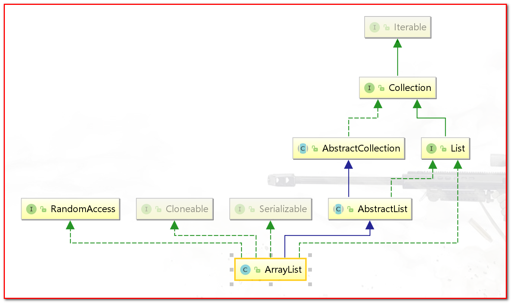
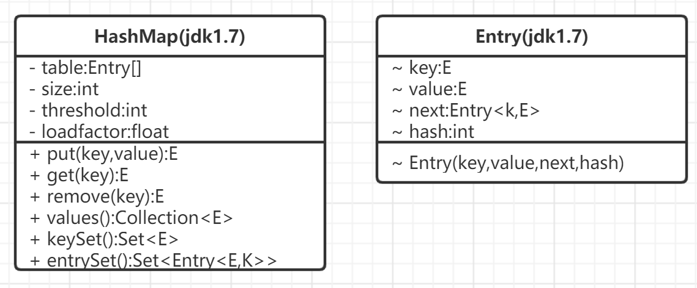

## 问题汇总

### 1. 字符串拼接中有三目运算符

```java
//        字符串拼接中的三目运算符
        String str = "";
        int a = 1;
        str = "aaaa" + (1==a?"haha":"hehe");//aaaahaha
        System.out.println(str);
```

未复现，在工作中遇到的上述代码仅打印`haha`的结果，待确认！

## 1. 编程基础

本质上计算机只会执行预先写好的指令，指令是操作数据或者设备。

---

程序就是告诉计算机要操作的数据和执行的指令序列。

---

所有的数据都需要放到内存中进行处理，程序很大一部分就是操作内存中的数据

---

数据在计算机内部是二进制表示的，若用程序直接操作二进制代码，编程难度过大，故高级语言引入了<font color='red'>数据类型和变量的概念</font>

### 1.1 基本类型和变量

### 1.2 赋值

数组的长度在定了之后不可变，如下操作会编译报错，因为length是final修饰的

```java
String[] strs = {"1","2"};
strs.length = 0;//想通过将数组的长度变为0，从达到清空数组的目的
```

### 1.3 基本运算

整数相除的结果总是整数，在以下代码中得到的结果均是整数；

整数相除若结果位有小数是直接舍弃小数位，而不是四舍五入;

> 【注】：2.0应该也是整数吧？哈哈

```java
int x = 5;
int y = 2;
int c = x/y; // 2
double d = x/y; // 2.0
```

### 1.4 条件执行

条件执行依赖于条件跳转指令和无条件跳转执行，如下解释

```java
boolean flag = true;
if(flag){
  sout
}
sout
```

```java
boolean flag = true;
if(flag)则条件跳转到第3行
若不满足上一步跳转条件，则无条件跳转到第5行
```

### 1.5 循环

> * 多次重复执行某些类似的操作，如展示一张张照片，显示一条条聊天记录，播放循环播放音乐,过滤数据等
> * 循环的4中形式
>     1. while
>     2. do/while
>     3. for
>     4. foreach

#### 循环中4中形式

1. while

    该语法与if语法类似,但是通常在循环体中存在循环中断或退出的条件；若没有该条件的就是个死循环了

    ```java
    while(condition){
      //do sth;
    }
    if(condition){
      //do sth;
    }
    ```

2. do/while

    如果不管条件语句是什么，代码块都会至少执行一次，则可以使用do/while循环

    ```java
    do{
      //do sth;
    }while(condition)
    ```

3. for

    需要注意for循环的执行流程,在以下流程中变量步进是在执行循环体之后的；

    1. 执行初始化命令
    2. 判断循环是否满足条件
    3. 若满足循环条件则执行循环体，否跳出循环
    4. <font color ='red'>变量自增或自减（步进）</font>
    5. 无条件跳转到第2步

    ```java
    for(变量初始化;循环判断条件;步进){
      do sth;
    }
    
    for (int i = 0; i < 10; i++) {
      System.out.println(i);
      //i++
    }
    
    for (int i = 0; i < 10; ++i) {
      System.out.println(i);
      //++i
    }
    ```

    

4. foreach

    该遍历过程中不存在索引变量，对于循环体中需要用到索引变量的情况不适用，但这种方式遍历更加简洁；

    ```java
    for(变量类型 变量 : 数组或集合)
    {
      //do sth;
    }
    ```

### 1.6 函数

> 函数：减少重复代码和分解复杂操作，使程序更加简洁，增加代码的可读性。
>
> 函数的返回值：
>
> * 函数需要返回多个相同类型的值，可以使用数组或者集合作为返回类型；
> * 函数需要返回的是一个复合值，如一个人的姓名、性别、年龄、生日等可以用类作为返回值；

---

#### 递归应用

> * 0的阶乘是1

```java
//递归二分查找
 /**
     * 递归操作 需要四个参数
     *
     * @param desArr 需要遍历的数组 有序
     * @param key    需要查找的值
     * @param start  查找开始的范围值
     * @param end    查找结束的范围值
     * @return 查找值在数组中的位置
     */
    public static int binarySearch(int[] desArr, int key, int start, int end) {
        //数组遍历完毕 找不目标数
        if(start > end){
            return -1;
        }
//        得到中间数
        int mid = start + (end - start)/2;
        //判断中间下标对应数组中的值与开始、结尾对应的数组中的值的大小关系
        if(desArr[mid] > key){
            return binarySearch(desArr,key,start,mid-1);
        }else if(desArr[mid] < key){
            return binarySearch(desArr,key,mid + 1,end);
        }else {
            return mid;
        }

    }

//阶乘
 public static int diGuiMulitp(int n){
        if(n <= 1){
            return 1;
        }
        return diGuiMulitp(n - 1) * n;
    }
```

```java
 /**
     * 二分查找非递归-while，由于二分查找在循环体中会操作循环控制变量start,end故使用while循环更好,while形式先定义变量最后返回变量的值，通用的一个操作形式，如本例中的result;
     * @param desArr 需要遍历的数组 有序
     * @param key
     * @param start
     * @param end
     * @return
     */
    public static int binarySearchWhile(int[] desArr, int key, int start, int end){
        int result = -1;
        while(start <= end){
            int mid = start + (end - start)/2;
            if(desArr[mid] > key){
                end = mid -1;
            }else if(desArr[mid] < key) {
                start = mid + 1;
            }else {
                result =  mid;
                break;
            }
        }
        return result;
    }
/**
阶乘的for循环
*/
public static int mulitpWhile(int n){
        int result = 1;
        for (int i = n; i > 1; i--) {
            result = result * i;
        }
        return result;

    }
//阶乘的while循环
public static int mulitpWhile(int n){
        int result = 1;
        while(n > 1){
            result = result * n;
            n--;
        }
        return result;

    }
```

---

#### 冒泡排序

```java
//冒泡排序
 public static void sortBubble(int[] desArr){
        for (int i = 0; i < desArr.length; i++) {
            for (int j = 0; j < desArr.length -1 - i; j++) {
                if (desArr[j]  > desArr[j+1]) {
                    int temp = desArr[j];
                     desArr[j] = desArr[j+1];
                     desArr[j+1] = temp;
                }
            }
        }

    }
```

---

#### int数组->list<Integer>->Integer[]

> [https://blog.csdn.net/ASDQWE09876/article/details/79271992](参考)

```java
//int数组转List<Integer>

List<Integer> integerList = Arrays.stream(intArr).boxed().collect(Collectors.toList());
//List<Integer>转int数组
intArr = integerList.stream().mapToInt(Integer::intValue).toArray();

//int数组转Integer[]
Integer[] integerArr = Arrays.stream(intArr).boxed().toArray(Integer[]::new);
//Integer[]转int[]

intArr  = Arrays.stream(integerArr).mapToInt(Integer::valueOf).toArray();
```

#### 函数调用的参数匹配

1. 是否有原配，即参数类型是否一模一样
2. 是否存在可以自动转换的参数类型，即小转大
    * 高精度 -> 低精度 short、byte、char -> int -> long -> float -> double
    * 子类 -> 父类
        * 参数类型是父类型，传入子类对象可以
    * 接口 -> 实现

#### 函数调用的基本原理

> 程序从main函数开始顺序执行，函数调用可以看作一个无条件跳转，跳转到对应函数的指令处开始执行，碰到return语句或者函数结尾的时候，再执行一次无条件跳转，跳转回调用方，执行调用函数后的下一条指令。
>
> 但这里面有几个问题。1）参数如何传递？2）函数如何知道返回到什么地方？在if/else、for中，跳转的地址都是确定的，但函数自己并不知道会被谁调用，而且可能会被很多地方调用，它并不能提前知道执行结束后返回哪里。3）函数结果如何传给调用方？
>
> 解决思路是使用内存来存放这些数据，函数调用方和函数自己就如何存放和使用这些数据达成一个一致的协议或约定。这个约定在各种计算机系统中都是类似的，存放这些数据的内存有一个相同的名字，叫栈。
>
> 栈是一块内存，但它的使用有特别的约定，一般是先进后出，类似于一个桶，往栈里放数据称为入栈，最下面的称为栈底，最上面的称为栈顶，从栈顶拿出数据通常称为出栈。栈一般是从高位地址向低位地址扩展，换句话说，栈底的内存地址是最高的，栈顶的是最低的。
>
> 栈来存放函数调用过程中需要的数据，包括参数、返回地址，以及函数内定义的局部变量


!(assets/image-20210809225439288.png)


##### 【注】：待详细研究。

##  2. 理解数据背后的二进制

> 正整数相乘的结果居然出现了负数
>
> ```java
> 1000000000*1000000000 //-1486618624
> ```
>
> 非常基本的小数运算结果居然不精确
>
> ```java
> 0.1*0.1//0.010000000000000002
> 1.1*1.1//1.2100000000000002
> ```
>
> 字符类型也可以进行算术运算和比较

### 2.1 整数的二进制表示与位运算

#### 十进制的计算规则

123 => 1*10^2 + 2 * 10^1 + 3* 10^0

从右向左，第一位乘以10的0次方，第二位乘以10的1次方...

#### 正整数的二进制表示

1111 => 1*2^3 + 1 * 2^2 + 1*2^1 + 1 * 2^0

​	 => 2^3 + 2^2 + 2^1 + 2^0

#### 负整数的二进制表示

十进制的负数表示就是在前面加一个负数符号-，例如-123。但二进制如何表示负数呢？其实概念是类似的，二进制使用最高位表示符号位，用1表示负数，用0表示正数

##### 整数类型分配的内存大小

整数有4种类型byte、short、int、long，分别占1、2、4、8个字节，即分别占8、16、32、64位

##### 补码表示负数

负数表示并不是我们直觉中将最高位变1，例如byte a=-1，如果只是将最高位变为1，二进制应该是10000001，但实际上，它应该是11111111。

补码表示就是在原码表示的基础上取反然后加1。取反就是将0变为1,1变为0。负数的二进制表示就是对应的正数的补码表示，比如：-1 => 1的原码表示是00000001，取反是11111110，然后再加1，就是11111111。

给定一个负数的二进制表示，要想知道它的十进制值，可以采用相同的补码运算。比如：10010010，首先取反，变为01101101，然后加1，结果为01101110，它的十进制值为110，所以原值就是-110。

> [【秒懂】byte的取值范围为什么是-128~127？](https://www.jianshu.com/p/47761557bab0)

> [两个byte类型的数据相加最后结果为什么是int？即使接收相加结果的变量是byte型也会报错](https://blog.csdn.net/ejiao1233/article/details/82292348)

#### 十六进制

十六进制的表示：二进制写起来太长，为了简化写法，可以将4个二进制位简化为一个0～15的数， 10～15用字符A～F表示，这种表示方法称为十六进制

123 => 0x7B => 7 * 16^1 + 11 * 16^0

​			=> 7 * 16 + 11 * 16

   二进制	=> 0111 1011 

   Hex  	=>  7   B（11）

##### java中十进制、二进制、16进制之间的转换

```java
class Tcal{
    public static void main(String[] args) {
        int a = 0x7B;//16进制
        System.out.println(a);//123
        System.out.println(Integer.toBinaryString(a));//1111011
        System.out.println(Integer.toHexString(a));//7b
    }
}
```

#### 位运算

##### 移位运算

> 无符号右移：>>>
>
> 有符号右移: >> 
>
> 左移：<<

左移 << 向左移动，右边低位补0，高位舍去，左移相当于*2

* 左移 << 不区分有无符号左移，使用同一个符号即可

无符号右移 >>> 向右移动，低位舍去，高位补0，相当于/2

有符号右移 >>> 向右移动，低位舍去，高位原来是1就补1，是0就补0，相当于/2

```java
 byte b = -4;
        System.out.println(b << 2);//左移 负数 -16
        System.out.println(b >> 2);//右移 负数 -1 有符号右移
        /*
        一个变量byte x = -4在进行移位运算时，这个变量是负数，移位运算时无符号位的右移操作,
        最终结果是1073741823 => 2^31 -1，也就是将负数int x = -4，x有32个位进行了右移操作；
        但为什么byte会自动转换为int然后无符号操作呢？
         */
        System.out.println(b >>> 2);//右移 负数 1073741823 无符号右移 2^31 -1

        byte c = 4;
        System.out.println(c << 2);//左移 正数 16
        System.out.println(c >>> 2);//右移 正数 1 无符号右移
        System.out.println(c >> 2);//右移 正数 1 有符号右移
```


##### 逻辑运算

> & : 与操作 
>
> | ： 或操作 
>
> ~ ： 取反操作
>
> ^ :  异或操作 => 相同为0，相反为1

两边的操作数转换成二进制做逻辑运算。

```java
int a = 10;
System.out.println(a & 0x1);//0
System.out.println(a & 1);//0
System.out.println(a & 2);//2
```

### 小数的二进制表示

如下例子中x * y的结果不精确，并非我们直观的0.01这是为什么呢？

> 实际上，不是运算本身会出错，而是计算机根本就不能精确地表示很多数，比如0.1这个数。计算机是用一种二进制格式存储小数的，这个二进制格式不能精确表示0.1，它只能表示一个非常接近0.1但又不等于0.1的一个数。数字都不能精确表示，在不精确数字上的运算结果不精确也就不足为奇了。
>
> 包括0.1+0.1虽然我们看到的结果是0.2但实际上这也是经过计算机处理的结果，不是计算机真正计算的结果。

```java
double x = 0.1;
double y = 0.1;
double s = x * y;
System.out.println(s);//0.010000000000000002
double xx = 0.01;
double yy = 0.01;
double ss = xx * yy;
System.out.println(ss);//1.0 * 10^-4
```

首先我们来看十进制：十进制也只能表示那些可以表述为10的多少次方和的数，比如12.345，实际上表示的是1× 10+2× 1+3× 0.1+4×0.01+5× 0.001，与整数的表示类似，小数点后面的每个位置也都有一个位权，从左到右，依次为0.1,0.01,0.001…即10^(-1),10^(-2),10^(-3)等。

很多数十进制也是不能精确表示的，比如1/3，保留三位小数的话，十进制表示是0.333，但无论后面保留多少位小数，都是不精确的，用0.333进行运算，比如乘以3，期望结果是1，但实际上却是0.999。二进制是类似的，但二进制只能表示那些可以表述为2的多少次方和的数。来看下2的次方的一些例子：2^(-1) = 0.5 , 2^(-2) = 0.25,2^(-3) = 0.125,2^(-4) = 0.0625

> <font color = 'red'>既然使用二进制无法准确的表示某些小数，而计算机底层是二进制存储的，那0.1,0.01在计算机中是如何存储的呢？</font>
>
> * 计算机有一套"舍入"原则，对于无法精确表示的数，会以尽可能接近它的二进制数表示。
>
> 在平常计算中我们如何处理这种不精确的情况呢？
>
> 1. 不需要精确，只需要保留小数点多少位即可；使用四舍五入或者舍掉小数点即可满足要求
> 2. <font color = 'red'>需要精确，如何处理呢？为什么这么处理就精确了呢？</font>
>     * 转换为整数？
>     * 使用java类BigDecimal?

#### 浮点数

> 【参考链接】：
>
> * [计算机是怎么存储数字的](https://www.jianshu.com/p/d52a542bb363)
> * [0.1+0.2!==0.3引发的思考-浮点数的存储和计算](https://juejin.cn/post/6854573211607269384)

0.1 + 0.2 != 0.3

> 计算机根本就不能精确地表示很多数，比如0.1这个数。计算机是用一种二进制格式存储小数的，这个二进制格式不能精确表示0.1，它只能表示一个非常接近0.1但又不等于0.1的一个数。数字都不能精确表示，在不精确数字上的运算结果不精确也就不足为奇了。

计算机在表示浮点数 F,当碰到无法精确表示的情况下，会有一套默认的规则去"四舍五入"表是这个数F，使在计算机中的表示尽可能的接近这个数 F。

十进制整数 => 二进制整数

78 如何使用二进制表示？

对于正整数，数学上有一个转换的公式，就是「除 2 取余，逆序排列」法。具体做法是：用 2 整除十进制整数，可以得到一个商和余数；再用 2 去除商，又会得到一个商和余数，如此进行，直到商为 0 时为止，然后把先得到的余数作为二进制数的低位有效位，后得到的余数作为二进制数的高位有效位，依次排列起来。对于 78 这个十进制整数来说，对应的二进制是 1001110.

十进制小数 => 二进制小数

0.5 如何使用二进制表示？

对于纯小数，也有一个固定的转换法：乘 2 取整，顺序排列。具体做法就是：用 2 乘十进制小数，可以得到积，将积的整数部分取出，再用 2 乘余下的小数部分，又得到一个积，再将积的整数部分取出，如此进行，直到积中的小数部分为零，此时 0 或 1 为二进制的最后一位。对于十进制的 0.5 来说，对应的二进制表示就是 0.1

IEEE 754标准

> 几乎所有的硬件和编程语言表示小数的二进制格式都是一样的。这种格式是一个标准，叫做IEEE 754标准，它定义了两种格式：一种是32位的，对应于Java的float；另一种是64位的，对应于Java的double。
>
> 32位格式中，1位表示符号，23位表示尾数，8位表示指数。64位格式中，1位表示符号，52位表示尾数，11位表示指数。在两种格式中，除了表示正常的数，标准还规定了一些特殊的二进制形式表示一些特殊的值，比如负无穷、正无穷、0、NaN（非数值，比如0乘以无穷大））

### 字符的编码与乱码

#### 字符的编码

分为两大类，一类是非Unicode编码，一列是Unicode编码

常见的非Unicode编码包括ASCII、ISO8859-1、Windows-1252、GB2312、GBK、GB18030和Big5。

Unicode主要做了这么一件事，就是给所有字符分配了唯一数字编号。它并没有规定这个编号怎么对应到二进制表示，这是与上面介绍的其他编码不同的，其他编码都既规定了能表示哪些字符，又规定了每个字符对应的二进制是什么，而Unicode本身只规定了每个字符的数字编号是多少。

那编号怎么对应到二进制表示呢？有多种方案，主要有UTF-32、UTF-16和UTF-8。

#### 字符的乱码

编解码的方式不同导致，有些切换解码就可以，有些则不行，不行的情况下就需要挨个编码去编码解码，但最终不一定可以解决乱码问题。

#### char类型

>  Java中还有Character、String、StringBuilder等类用于文本处理，它们的基础都是char
>
> 为什么字符类型也可以进行算术运算和比较呢？它的本质到底是什么呢？
>
> char本质上是一个固定占用两个字节的无符号正整数，这个正整数对应于Unicode编号，用于表示那个Unicode编号对应的字符。
>
> 由于固定占用两个字节，char只能表示Unicode编号在65 536以内的字符，而不能表示超出范围的字符。那超出范围的字符怎么表示呢？使用两个char。类Character、String有一些相关的方法

##### char的几种赋值方式

```java
char a = 'A';//一个能用ASCII码表示的字符赋给一个字符变量

char a = '马'；

char a = 39532;//第3种赋值方式是直接将unicode十进制的常量赋给字符

char a = 0x9a6c;//将十六进制常量赋给字符

char a = '\u9a6c';//第5种赋值方式是按Unicode字符形式
```

##### char的算数运算

> 由于char本质上是一个固定占用两个字节的无符号正整数，所以可以进行整数能做的一些运算，<font color='red'>在进行运算时会被看做int类型，但由于char占用两个字节，所以运算结果不能直接赋值给char，需要进行强制类型转换，【注】这和byte、short参与整数运算类似</font>

从上述标红字体的描述中得到 => char，byte，short在参与整数运算时都会被看做int类型，即其参与运算最终的结果是int型，如果接受运算结果类型是char,byte,short就需要强制类型转化，否则会报错；以下是一些亲测示例：

```java
//byte,short,char类型参与运算 是看做int型参与运算的，最终结果也是int型
        byte a = 1;
        byte b = 1;
        int c = a + b;//2
        byte c = a + b;//error
        
        char a = '1';
        char b = '2';
        char c = a +b;//error
        int c = a + b;
        
        short a = '1';
        short b = '2';
        short c = a +b;//error
        int c = a + b;
```

> char的加减运算就是按其Unicode编号进行运算，一般对字符做加减运算没什么意义，但ASCII码字符是有意义的。比如大小写转换，大写A～Z的编号是65～90，小写a～z的编号是97～122，正好相差32，所以大写转小写只需加32，而小写转大写只需减32。加减运算的另一个应用是加密和解密，将字符进行某种可逆的数学运算可以做加解密

char的算数运算作用有两方面

1. 大小写字母之间的转换
2. 加密和解密

## 3. 类的基础

### 基础

> 通过private封装和隐藏内部实现细节，避免被误操作，是计算机程序的一种基本思维方式。
>
> p = new Point()；创建了一个实例或对象，然后赋值给了Point类型的变量p，它至少做了两件事：1）分配内存，以存储新对象的数据，对象数据包括这个对象的属性，具体包括其实例变量x和y。2）给实例变量设置默认值，int类型默认值为0。
>
> ❑ Point p = new Point()；是定义数据并设置默认值。
>
> ❑ p.x = 2; p.y = 3；是赋值。
>
> ❑ p.distance()是数据的操作。
>
> 可以看出，对实例变量和实例方法的访问都通过对象进行，通过对象来访问和操作其内部的数据是一种基本的面向对象思维。<font color='red'>本例中，我们通过对象直接操作了其内部数据x和y，这是一个不好的习惯，一般而言，不应该将实例变量声明为public，而只应该通过对象的方法对实例变量进行操作。这也是为了减少误操作，直接访问变量没有办法进行参数检查和控制，而通过方法修改，可以在方法中进行检查(即可以进行一些关联性的校验如非空校验~等等)。</font>

针对红字部分的描述，我今后在创建类时应默认将成员变量设置成private，而后如果需要获取或者操作这个变量值仅通过其对应的成员方法来操作。

在new一个对象的时候，至少会做两件事情1. 给对象分配内存，以存储对象的数据 2. 给实例变量设置默认值，<font color ='red'>在后续的学习中关注一下类中各个成员的初始化顺序。</font>

#### 类和对象的生命周期

> 当通过new创建一个对象的时候，对象产生，在内存中，会存储这个对象的实例变量值，每做new操作一次，就会产生一个对象，就会有一份独立的实例变量。
>
> 每个对象除了保存实例变量的值外，可以理解为还保存着对应类型即类的地址，这样，通过对象能知道它的类，访问到类的变量和方法代码。

讲解的基础的东西

### 类的组合

> 程序是用来解决现实问题的，将现实中的概念映射为程序中的概念，是初学编程过程中的一步跨越。本节通过一些例子来演示如何将一些现实概念和问题通过类以及类的组合来表示和处理，涉及的概念包括图形处理、电商、人之间的血缘关系以及计算机中的文件和目录。

<font color ='red'>在我现阶段的编程中我是否思考过上述观点，我是否可以通过类中的成员变量、类与类之间的关系反推到现实中的业务关系。</font>在javaAPI的类中需要关注的可能就是成员方法，他们并不存在业务属性。

### 类路径


### 程序的编译与连接（运行）

> 从Java源代码到运行的程序，有编译和链接两个步骤。编译是将源代码文件变成扩展名是．class的一种字节码，这个工作一般是由javac命令完成的。链接是在运行时动态执行的，.class文件不能直接运行，运行的是Java虚拟机，虚拟机听起来比较抽象，执行的就是Java命令，这个命令解析．class文件，转换为机器能识别的二进制代码，然后运行。所谓链接就是根据引用到的类加载相应的字节码并执行。

### 模块化的概念

> 在Java 9中，清晰地引入了模块的概念，JDK和JRE都按模块化进行了重构，传统的组织机制依然是支持的，但新的应用可以使用模块。一个应用可由多个模块组成，一个模块可由多个包组成。模块之间可以有一定的依赖关系，一个模块可以导出包给其他模块用，可以提供服务给其他模块用，也可以使用其他模块提供的包，调用其他模块提供的服务。对于复杂的应用，模块化有很多好处，比如更强的封装、更为可靠的配置、更为松散的耦合、更动态灵活等。模块是一个很大的主题，限于篇幅，我们就不详细介绍了。

## 4. 类的继承

### 基础

子类对象不能直接访问父类的私有属性和方法，当然父类对象在类外边也无法访问其私有属性和方法。

重写只针对成员方法，且在调用时存在动态绑定 -> 运行多态；

父类的方法必须是非private才可以被子类重写；

父类引用指向子类对象，调用重写方法是子类中重写的；

> 【注】：继承有什么缺点？


在父类构造函数中调用重载方法，最终输出与结果与预期不符分析，代码如下：

```java
class Base{
    public Base(){
        test();
    }

    public void test(){
        System.out.println("base");
    }
}

class Child extends Base{
    public int a = 1;
    @Override
    public void test(){
        System.out.println("Child");
        System.out.println(a);
        System.out.println("----------");

    }

    public static void main(String[] args) {
        Child child = new Child();
        /*
        在创建子类对象时 调用父类的无参构造方法，
        由于父类的无参构造方法回调用test()方法而test()又被子类重写，
        故此处会调用子类的test()方法，但由于在调用父类构造方法时子类的成员变量赋值语句还没执行，故打印结果是0；
        
        但在实际写代码时不应该在父类的构造函数中调用public的方法，这样很容易造成歧义，降低代码的可读性。
        Child
        0
        Child
        1
         */
        child.test();
    }
}
```

#### 重名与静态绑定

> 静态绑定:静态绑定在程序编译阶段即可决定。通过类型就可判断调用的是子类还是父类的成员变量，静态变量，静态方法；
>
> 动态绑定：态绑定则要等到程序运行时。

当子类和父类中同时存在同名的成员变量，静态变量，静态方法时，最终访问这些内容的变量类型是什么（父类、子类）最终就会调用对应类型的成员变量，静态变量，静态方法；

#### 重载和重写

> 重载是指方法名称相同但参数签名不同（参数个数、类型或顺序不同）
>
> 重写是指子类重写与父类相同参数签名的方法
>
> 当有多个重名函数的时候，在决定要调用哪个函数的过程中，首先是按照参数类型进行匹配的，换句话说，寻找在所有重载版本中最匹配的，然后才看变量的动态类型，进行动态绑定。

重载中类型匹配遵从自动向上转型原则，即"大"可以兼容"小"

* 基本类型：表示范围大的兼容小的
* 引用类型：父类兼容子类

#### 继承访问权限protected

```java
class Base{

    protected int currentStep;
    protected void step1(){}
    protected void step2(){}

    public void action(){
        this.currentStep = 1;
        step1();
        this.currentStep = 2;
        step2();

    }

}

class Child extends Base{
    @Override
    protected void step1(){
        System.out.println("child step " + this.currentStep);
    }
    
    @Override
    protected void step2(){
        System.out.println("child step " + this.currentStep);

    }

    public static void main(String[] args) {
        Child child = new Child();
        child.action();
    }


}
```

> 基类定义了表示对外行为的方法action，并定义了可以被子类重写的两个步骤step1()和step2()，以及被子类查看的变量currentStep，子类通过重写protected方法step1()和step2()来修改对外的行为。
>
> 这种思路和设计是一种设计模式，称之为模板方法。action方法就是一个模板方法，它定义了实现的模板，而具体实现则由子类提供。模板方法在很多框架中有广泛的应用，这是使用protected的一种常见场景。

#### 重写-可见性

即访问权限及抛出异常的范围子类也要比父类大；

> 重写方法时，一般并不会修改方法的可见性。但我们还是要说明一点，重写时，子类方法不能降低父类方法的可见性。不能降低是指，父类如果是public，则子类也必须是public，父类如果是protected，子类可以是protected，也可以是public，即子类可以升级父类方法的可见性但不能降低;
>
> 为什么要这样规定呢？继承反映的是“is-a”的关系，即子类对象也属于父类，子类必须支持父类所有对外的行为，将可见性降低就会减少子类对外的行为，从而破坏“is-a”的关系，但子类可以增加父类的行为，所以提升可见性是没有问题的。

#### 防止继承-final

> 继承是把双刃剑，带来的影响就是，有的时候我们不希望父类方法被子类重写，有的时候甚至不希望类被继承，可以通过final关键字实现

---

### 继承实现的基本原理

#### 类加载过程

静态代码块，实例代码块，构造方法，父类静态代码块，父类实例代码块，父类构造方法调用顺序

```java
class Base {

    public static int s;
    private int a;

    static {
        System.out.println("基类静态代码块，s: " + s);
        s = 1;
    }

    {
        System.out.println("基类实例代码块，a: " + a);
        a = 1;
    }

    public Base(){
        System.out.println("基类构造方法，a: " + a);
        a = 2;
    }

    public void step(){
        System.out.println("base s: " + s + " a :" + a );
    }

    public void action(){
        System.out.println("action method start");
        step();
        System.out.println("action method end");
    }

}

class Child extends Base {
    public static int s;
    private int a;

    static {
        System.out.println("子类静态代码块，s: " + s);
        s = 10;
    }

    {
        System.out.println("子类实例代码块，a: " + a);
        a = 10;
    }

    public Child(){
        System.out.println("子类构造方法，a: " + a);
        a = 20;
    }

    public void step(){
        System.out.println("Child s: " + s + " a :" + a );
    }

    public static void main(String[] args) {
        System.out.println("-- new child()");
        Child child = new Child();
        System.out.println("\n --- child.action()");
        child.action();
        Base b = child;
        System.out.println("---b.action()");
        b.action();
        System.out.println("b.s: " + b.s);
        System.out.println("child.s: " + child.s);

        /*
        将类加载到内存中
        基类静态代码块，s: 0
        子类静态代码块，s: 0
        -- new child()
        基类实例代码块，a: 0
        基类构造方法，a: 1
        子类实例代码块，a: 0
        子类构造方法，a: 10
        --- child.action()
        action method start
        Child s: 10 a : 20
        action method end
        --- b.action()
        action method start
        Child s: 10 a : 20
        action method end
        b.s : 1
        child.s : 10

         */

    }


}
```


> 在Java中，所谓类的加载是指将类的相关信息加载到内存。在Java中，类是动态加载的，当第一次使用这个类的时候才会加载，加载一个类时，会查看其父类是否已加载，如果没有，则会加载其父类。
>
> 1）一个类的信息主要包括以下部分：
>
> * 类变量（静态变量）；
> * 类初始化代码；
>     * 定义静态变量时的赋值语句；
>     * 静态初始化代码块。
> * 类方法（静态方法）；
> * 实例变量；
> * 实例初始化代码；
>     * 定义实例变量时的赋值语句；
>     * 实例初始化代码块；
>     * 构造方法。
> * 实例方法；
> * 父类信息引用。
>
> 2）类加载过程包括：
>
> * 分配内存保存类的信息；
> * 给类变量赋默认值；
> * 加载父类；
> * 设置父子关系；
> * 执行类初始化代码。
>
> 注意，类初始化代码，是先执行父类的，再执行子类的。不过，父类执行时，子类静态变量的值也是有的，是默认值。对于默认值，我们之前说过，数字型变量都是0, boolean是false, char是'\u0000'，引用型变量是null。

对上述引用中

1. char是'\u0000'是一个类似空格的字符；它的unicode编码是'\u0000'
2. <font color ='red'>什么时候给类变量和成员变量赋初值的呢？</font>

3. 存放类的信息，这个区在java中称为方法区。在类加载后，java方法区就有了一份这个类的信息；下图为类信息内存布局，对应类加载过程中的分配内存保存类的信息；给类变量赋默认值；加载父类；设置父子关系；`之后会执行类初始化代码`。
4. <font color ='red'>要注意 类加载过程是上述引用中的2），执行类初始化代码是类加载过程的"最后步骤"</font>


#### 对象创建的过程

以上个代码创建对象为例

> 在类加载之后，new Child()就是创建Child对象，创建对象过程包括：
>
> 1. 分配内存；
> 2. 对所有实例变量赋默认值；
> 3. 执行实例初始化代码。
>     * 定义实例变量时的赋值语句；
>     * 实例初始化代码块；
>     * 构造方法;
>
> 分配的内存包括本类和所有父类的实例变量，但不包括任何静态变量。实例初始化代码的执行从父类开始，再执行子类的。但在任何类执行初始化代码之前，所有实例变量都已设置完默认值。每个对象除了保存类的实例变量之外，还保存着实际类信息的引用。

我转述一下对上述引用的理解：在类加载进内存后，即类实例初始化完成后，创建子类的对象new Child()，首先会判断其有没有父类，若存在父类则先给父类分配内容，然后给子类分配内存，然后对父类、子类的所有实例变量赋默认初值，在之后执行实例初始化代码，即实例变量的赋值语句，实例初始化代码块，构造方法；<font color = 'red'>另外每个对象中保存两部分内容:1. 类的实例变量；2. 实际类信息的引用</font>

#### 方法调用的过程

在涉及继承的方法调用中，当父类引用指向子类的对象 Base b = new Child()；调用重写方法时b.action(),b.step();是从<font color = 'red'>对象的实际类型信息(在对象中保存着该信息)</font>开始查找的,若找不到该方法就回去父类中去找；

动态绑定实现的机制就是根据对象的实际类型查找要执行的方法，子类型中找不到的时候再查找父类。

> 如果继承的层次比较深，要调用的方法位于比较上层的父类，则调用的效率是比较低的，因为每次调用都要进行很多次查找。大多数系统使用一种称为虚方法表的方法来优化调用的效率。
>
> 所谓虚方法表，就是在类加载的时候为每个类创建一个表，记录该类的对象所有动态绑定的方法（包括父类的方法）及其地址，但一个方法只有一条记录，子类重写了父类方法后只会保留子类的。

虚方法表：每个方法在表中对应着方法调用的地址，对"每个方法"需要特别强调，它指的是子类能够调用的所有方法（包括继承自父类的）和父类的所有方法；

#### 变量访问的过程

对象访问变量，不论是对类变量，还是实例变量，均是静态绑定，在编译期就已经决定了；通过类型就可判断调用的是子类还是父类的成员变量，静态变量，静态方法；

---

### 为什么说继承是把双刃剑

> 继承为什么会有破坏力呢？主要是因为继承可能破坏封装，而封装可以说是程序设计的第一原则；另外，继承可能没有反映出is-a关系

继承缺点在于：

1. 继承可能会破坏封装性 

    ​	封装即隐藏实现细节，提供简化接口，使用者不必关系内部的实现，实现的细节可以随时修改，不影响使用；在设计代码时函数、类都用到了封装的思想；

    ​	继承可能会导致子类在继承父类时不得不考虑实现细节，父类在修改内部实现时可能需要考虑子类的功能；从而使程序的构建和维护难度上升；破坏了封装的思想。

2. 继承并没有体现is - a的关系，违背继承的设计初衷?

    > ​	继承关系是设计用来反映is-a关系的，子类是父类的一种，子类对象也属于父类，父类的属性和行为也适用于子类。就像橙子是水果一样，水果有的属性和行为，橙子也必然都有。但现实中，设计完全符合is-a关系的继承关系是困难的。比如，绝大部分鸟都会飞，可能就想给鸟类增加一个方法fly()表示飞，但有一些鸟就不会飞，比如企鹅。在is-a关系中，重写方法时，子类不应该改变父类预期的行为，但是这是没有办法约束的。
    >
    > ​	还是以鸟为例，你可能给父类增加了fly()方法，对企鹅，你可能想，企鹅不会飞，但可以走和游泳，就在企鹅的fly()方法中，实现了有关走或游泳的逻辑。
    >
    > ​	继承是应该被当作is-a关系使用的，但是，Java并没有办法约束，父类有的属性和行为，子类并不一定都适用，子类还可以重写方法，实现与父类预期完全不一样的行为。但对于通过父类引用操作子类对象的程序而言，它是把对象当作父类对象来看待的，期望对象符合父类中声明的属性和行为。如果不符合，结果是什么呢？混乱。

### 如何应对继承的双面性

> 1）避免使用继承；
>
> ​	有三种方法：❑ 使用final关键字；❑ 优先使用组合而非继承；❑ 使用接口。
>
> 2）正确使用继承。

```java
class Base {

    private static final int MAX_NUM = 1000;
    private int[] arr = new int[MAX_NUM];
    private int count;
    public void add(int number){
        if(count < MAX_NUM){
            arr[count ++] = number;
        }

    }

    public void addAll(int[] numbers){
        for (int number : numbers) {
            if(count >= MAX_NUM){
                break;
            }
            //此处使用子类的add方法，比较意外，super.addAll()调用父类的addAll()然后调用子类的add()方法！
            add(number);
        }

    }
}

class Child extends Base {
    private long sum;

    @Override
    public void add(int number){
        super.add(number);
        sum += number;

    }

    public void addAll(int[] numbers){
        super.addAll(numbers);
        for (int number : numbers) {
            sum += number;
        }

    }

    public long getSum(){
        return sum;
    }

    public static void main(String[] args) {
        Child c = new Child();
        c.addAll(new int[]{1,123,13});
        System.out.println(c.getSum());//274
    }
}
```

上述代码的运行结果与预期不符；<font color ='red'>super.addAll()调用父类的addAll()然后调用子类的add()方法！</font>

* <font color = 'red'>引出一个问题：父类的引用和父类的对象有什么关系</font>

采用组合类的方式修改子类代码，解决上述问题

```java
class Child extends Base {
    private long sum;
    private Base base;

    {
        base = new Base();
    }
    @Override
    public void add(int number){
        base.add(number);
        sum += number;

    }

    public void addAll(int[] numbers){
        base.addAll(numbers);
        for (int number : numbers) {
            sum += number;
        }

    }

    public long getSum(){
        return sum;
    }

    public static void main(String[] args) {
        Child c = new Child();
        c.addAll(new int[]{1,123,13});
        System.out.println(c.getSum());//137
    }
}
```

## 5. 类的扩展

> 本章内容：
>
> 接口
>
> 抽象类
>
> 内部类
>
> 枚举

### 接口的本质

> 有些场景中，我们不关心对象的类型，仅仅注重对象的能力，即这个对象的方法；
>
> 比如要拍照，很多时候，只要能拍出符合需求的照片就行，至于是用手机拍，还是用Pad拍，或者是用单反相机拍，并不重要，即关心的是对象是否有拍出照片的能力，而并不关心对象到底是什么类型，手机、Pad或单反相机都可以。
>
> 又如要计算一组数字，只要能计算出正确结果即可，至于是由人心算，用算盘算，用计算器算，用计算机软件算，并不重要，即关心的是对象是否有计算的能力，而并不关心对象到底是算盘还是计算器。
>
> 再如要将冷水加热，只要能得到热水即可，至于是用电磁炉加热，用燃气灶加热，还是用电热水壶加热，并不重要，即重要的是对象是否有加热水的能力，而并不关心对象到底是什么类型。
>
> 在以上场景中类型不重要，重要的是实现功能，即提供方法；

接口是这样的"类"，不注重类型，重点关注"能力","方法"

#### 接口的介绍

> 接口声明了一组能力，但它自己并没有实现这个能力，它只是一个约定。接口涉及交互两方对象，一方需要实现这个接口，另一方使用这个接口，但双方对象并不直接互相依赖，它们只是通过接口间接交互。

当一个类实现了某个接口，那它便拥有了接口指定的"能力"，当类实现多个接口，那它便拥有了多个"能力"

#### 接口的声明

```java
public interface MyComparable {
    public abstract int compareTo(Object other);
//    int compareTo();
}


class Point implements MyComparable{
    private int x;
    private int y;
    public Point(int x,int y){
        this.x = x;
        this.y = y;
    }
    //点到原点之间的距离
    public double distance(){
        return Math.sqrt(x*x + y*y);
    }

    @Override
    public int compareTo(Object other) {
        //1. 判断other类型是否是Point及其子类
        if(!(other instanceof Point)){
            throw new IllegalArgumentException();
        }
        //2. 计算两个点到原点的距离，并比较大小
        Point otherPoint = (Point)other;
        /*double otherDistance = otherPoint.distance();
        double curDistance = distance();
        if(otherDistance > curDistance){
            return -1;
        }else if(otherDistance == curDistance){
            return 0;
        }*/
        //改写上述注释代码定义一个两个点距离原点之差的变量disVar
        double disVar = otherPoint.distance() - distance();
        if(disVar > 0){
            return -1;
        }else if(disVar == 0){
            return 0;
        }
        return 1;
    }

    public static void main(String[] args) {
        Point point = new Point(3, 4);
        Point otherPoint = new Point(4, 5);
        int rst = point.compareTo(otherPoint);
        System.out.println(rst);
    }

}
```

声明接口时，使用implement关键字，在定义接口中的方法不论加不加修饰符其效果都是等价于加了public abstract;

接口中的变量：pubic static final int  a = 2;当声明为int a时，也相当于加上public static final

接口可以多继承

接口也可以使用instanceof来判断对象是否是接口类型；

#### java8中接口的新特性

> 在没有默认方法之前，Java是很难给接口增加功能的，比如List接口（第9章介绍），因为有太多非Java JDK控制的代码实现了该接口，如果给接口增加一个方法，则那些接口的实现就无法在新版Java上运行，必须改写代码，实现新的方法，这显然是无法接受的。函数式数据处理需要给一些接口增加一些新的方法，所以就有了默认方法的概念，接口增加了新方法，而接口现有的实现类也不需要必须实现
>
> 在Java 8中，静态方法和默认方法都必须是public的，Java 9去除了这个限制，它们都可以是private的，引入private方法主要是为了方便多个静态或默认方法复用代码

1. 允许在接口中定义两类新方法：静态方法public static和默认方法 default，它们有方法体

    比如，Java API中，Collection接口有一个对应的单独的类Collections，在Java 8中，就可以直接写在接口中了，比如Comparator接口就定义了多个静态方法。

---

### 抽象类

#### 抽象类诞生的背景

> 抽象方法和抽象类看上去是多余的，对于抽象方法，不知道如何实现，定义一个空方法体不就行了吗？而抽象类不让创建对象，看上去只是增加了一个不必要的限制。
>
> 引入抽象方法和抽象类，是Java提供的一种语法工具，对于一些类和方法，引导使用者正确使用它们，减少误用。使用抽象方法而非空方法体，子类就知道它必须要实现该方法，而不可能忽略，若忽略Java编译器会提示错误。使用抽象类，类的使用者创建对象的时候，就知道必须要使用某个具体子类，而不可能误用不完整的父类。

抽象类就是java提供的一种使用规范；必须实现抽象类的抽象方法；

---

#### 抽象类的相关语法

抽象类可以没有抽象方法。抽象类和具体类一样，可以定义具体方法、实例变量等，它和具体类的核心区别是，抽象类不能创建对象(比如，不能使用new Shape())，而具体类可以。

---

#### 抽象类和接口

##### 异同点

* 共同点
    1. 都不能用于创建对象

* 不同点

    1. 成员不同：在jdk1.7及之前接口中只包含抽象方法和静态变量，而抽象类中可以不包含抽象方法，可以定义成员变量，甚至可以和普通类相同

    2. 用法不同：一个类可以实现多个接口，但只能继承一个抽象类

---

##### 抽象类和接口之间的关系

此处引用书中的描述

> 抽象类和接口是<font color ='red'>配合而非替代关系</font>，它们经常一起使用，接口声明能力，抽象类提供默认实现，实现全部或部分方法，<font color ='red'>一个接口经常有一个对应的抽象类</font>。比如，在Java类库中，有：
>
> * Collection接口和对应的AbstractCollection抽象类。
> * List接口和对应的AbstractList抽象类
> * Map接口和对应的AbstractMap抽象类。
>
> 对于需要实现接口的具体类而言，有两个选择：一个是实现接口，自己实现全部方法；<font color ='red'>另一个则是继承抽象类，然后根据需要重写方法。</font>
>
> 继承的好处是复用代码，只重写需要的部分即可，需要编写的代码比较少，容易实现。不过，如果这个具体类已经有父类了，那就只能选择实现接口了。

抽象类和接口搭配使用；抽象类实现接口并提供接口全部或部分"能力"的默认实现

<font color ='red'>另：通过代码编译发现，抽象类实现接口可以不实现接口的抽象方法，抽象类继承抽象类也是如此</font>


---

### 内部类的本质

> 一般而言，内部类与包含它的外部类有比较密切的关系，而与其他类关系不大，定义在类内部，可以实现对外部完全隐藏，可以有更好的封装性，代码实现上也往往更为简洁。
>
> 内部类只是Java编译器的概念，对于Java虚拟机而言，它是不知道内部类这回事的，<font color= 'red'>每个内部类最后都会被编译为一个独立的类，生成一个独立的字节码文件</font>

内部类最终都会被编译成一个独立与外部类的类，生成一个独立的字节码文件。

---

#### 内部类的分类

内部类分为4类

1. 静态内部类

2. 成员内部类
3. 方法内部类（局部内部类）
4. 匿名内部类

> 方法内部类是在一个方法内定义和使用的；匿名内部类使用范围更小，<font color= 'red'>它们都不能在外部使用；</font>
>
> 成员内部类和静态内部类可以被外部使用，不过它们都可以被声明为private，这样，外部就不能使用了

方法内部类和匿名内部类都不能供外部类使用；

成员内部类和静态内部类可以供外部类使用，但是其声明为private时，外部类便不能访问内部类了<font color= 'red'>不对啊，经验证当静态内部类和成员内部类声明成private外部类也可以访问其内部；</font>；

【注】：对上句中红字描述，作者可能是要说外部外访问内部类private的内部类无法访问，而不是外部类中访问内部类

---

##### 静态内部类

```java
/*
内部类
    * 静态内部类
 */
public class Test {
    //定义外部类的私有静态变量
    private static int outVar = 100;
    //定义静态内部类
    public static class InnerClass{
        //静态类内部定义方法访问外部类类变量
        public void accessOutVar(){
            System.out.println(outVar);
        }
        public static void innerStaticMethod(){
            System.out.println("innerStaticMethod");
        }
    }
    //外部类定义方法创建内部类对象并调用内部类方法访问外部类类变量
    public void test(){
        //直接创建静态内部类对象
        InnerClass ic = new InnerClass();
        //调用静态内部类中的成员方法
        ic.accessOutVar();
        //通过类名调用静态内部类中的静态方法
        InnerClass.innerStaticMethod();
    }

    //main函数测试
    public static void main(String[] args) {
        //在main方法中直接创建内部类的对象
        InnerClass innerClass = new InnerClass();
        //内部类对象调用其成员方法
        innerClass.accessOutVar();
        System.out.println("-------------------");
        //外部类对象调用外部类方法，外部类方法中调用了内部类的方法
        new Test().test();
        //在外部类中通过类名.内部类静态方法名直接调用
        Test.InnerClass.innerStaticMethod();
    }

}
```

静态内部类不能访问外部类的成员变量，成员方法，只能访问外部类的静态变量和静态方法；

---

静态内部实现

静态内部类访问了外部类的私有静态变量，java的实现是为内部类在外部类中声明一个非私有的静态方法；


---


静态内部类的使用场景

* Integer类内部有一个私有静态内部类IntegerCache，用于支持整数的自动装箱。
* 表示链表的LinkedList类内部有一个私有静态内部类Node，表示链表中的每个节点。
* Character类内部有一个public静态内部类UnicodeBlock，用于表示一个Unicode block。

---

##### 成员内部类

> 与静态内部类不同，除了静态变量和方法，成员内部类还可以直接访问外部类的实例变量和方法;
>
> 在外部类内，使用成员内部类与静态内部类是一样的，直接使用即可
>
> 与静态内部类不同，成员内部类对象总是与一个外部类对象相连的，在外部使用时，它不能直接通过new Outer.Inner()的方式创建对象，而是要先将创建一个Outer类对象
>
> 创建内部类对象的语法是“外部类对象．new 内部类()”，如outer.new Inner()。
>
> <font color = 'red'>与静态内部类不同，成员内部类中不可以定义静态变量和方法（final变量例外，它等同于常量），下面介绍的方法内部类和匿名内部类也都不可以。</font>

---

成员内部类实现


---

成员内部类使用场景

> 在Java API的类LinkedList中，它的两个方法listIterator和descendingIterator的返回值都是接口Iterator，调用者可以通过Iterator接口对链表遍历，listIterator和descend-ingIterator内部分别使用了成员内部类ListItr和DescendingIterator，这两个内部类都实现了接口Iterator。

---

##### 方法内部类

> 类Inner定义在外部类方法test中，方法内部类只能在定义的方法内被使用。如果方法是实例方法，则除了静态变量和方法，内部类还可以直接访问外部类的实例变量和方法，如innerMethod直接访问了外部私有实例变量a。
>
> <font color = 'red'>如果方法是静态方法，则方法内部类只能访问外部类的静态变量和方法。方法内部类还可以直接访问方法的参数和方法中的局部变量，不过，这些变量必须被声明为final</font>
>
> 【注】：jdk1.8后方法的参数不用声明成final类型，而方法的局部变量如果要被方法内部类使用则就需要声明为final；


---

具体为什么需要声明成final，貌似可以从编译后的源文件看出；

【注】：final的数组地址不能变，但数组的内容可以变；对象也是同样，对象的地址不能变，但对象的成员变量可以改变

##### 匿名内部类

###### 语法

```java
new 父类/接口(参数列表){
  //匿名实现部分
}
```

---

###### 匿名内部类实现回调

>  Arrays.sort中传递的Comparator对象，它的compare方法并不是在写代码的时候被调用的，而是在Arrays. sort的内部某个地方回过头来调用的

这是啥回调？？？

---

### 4 枚举类的本质

> 1. [自行实践实现不了网上对枚举类型的编译结果，还是寻不到太合适的解释，参考如下文章](https://segmentfault.com/a/1190000019196740,https://www.cnblogs.com/hollischuang/p/10836913.html)
>     * [Java代码的编译与反编译那些事儿](https://www.cnblogs.com/hollischuang/p/10836913.html)
>     * [javap命令与Java Dcompiler工具、IDEA自带的反编译器反编译的结果的差别及原因](https://segmentfault.com/a/1190000019196740)
> 2. 枚举中每个枚举值对应的ordinal()方法返回的`定义顺序与数组相同，均是从0开始`
> 3. 枚举类中是含有构造方法的（不论是自定义的构造方法，还是系统默认的），且构造方法是`private`，否则编译会报错

#### 4.1 不带参的枚举

```java
public enum  EnumTest {
    BIG,MID,SMALL
}

```


#### 4.2 不带参枚举的本质

```tex
javap EnumTest.class
```

javap命令

```java
public final class test.EnumTest extends java.lang.Enum<test.EnumTest> {
  public static final test.EnumTest BIG;
  public static final test.EnumTest MID;
  public static final test.EnumTest SMALL;
  
  public static test.EnumTest[] values();
  
  public static test.EnumTest valueOf(java.lang.String);
  static {};
  
}
```

使用上面命令编译后的结果

1. 枚举类型从反编译结果来看它也是类，但编译器对它做了特殊处理
2. `枚举值实际上是静态变量即类变量，也是final的，不能被修改；`
3. values(),vlaueOf()等都是编译器自己添加的

#### 4.3 Enum抽象类的方法

##### 4.3.1 静态方法

values（）

* 返回枚举字面值数组，`顺序与定义时顺序相同`
<<<<<<< HEAD

valueOf（param1）

=======

valueOf（param1）

>>>>>>> 270736437bf7787df9a5809adb6f9150607fa899
* 返回与param1值相同的字面常量

##### 4.3.2 成员方法

toString()

* 枚举变量的toString方法返回其字面值

name()

* 枚举变量的toString方法返回其字面值

#### 4.4 枚举的Switch用法

`枚举switch比较的是枚举值对应的ordinary()返回值`

```java
public static void switchUser(EnumTest02 enumObj){
        switch (enumObj){
            case BIG:
                System.out.println("big");
                break;
            case MID:
                System.out.println("mid");
                break;
            case SMALL:
                System.out.println("small");
                break;
        }

    }
```


#### 4.5 带参数的枚举

#### 4.6 带参数枚举的本质


## 6. 异常

> 【注】
>
> 1. 在程序中使用throw关键字抛出异常相当于使用了return

### 6.1 异常基础

>  throw关键字可以与return关键字进行对比。return代表正常退出，throw代表异常退出；return的返回位置是确定的，就是上一级调用者，而throw后执行哪行代码则经常是不确定的，由异常处理机制动态确定。
>
> 异常处理机制会从当前函数开始查找看谁“捕获”了这个异常，当前函数没有就查看上一层，直到主函数，如果主函数也没有，就使用默认机制，即输出异常栈信息并退出，这正是我们在屏幕输出中看到的。
>
> 异常是相对于return的一种退出机制，可以由系统触发，也可以由程序通过throw语句触发，异常可以通过try/catch语句进行捕获并处理，如果没有捕获，则会导致程序退出并输出异常栈信息。


```java
 public void testEx02(){
        int a =1;
        System.out.println(a);
        throw new NullPointerException("haha");
        //System.out.println(a); 不可达
    }

 public void testEx02(){
        int a =1;
        System.out.println(a);
        return;
        //System.out.println(a); 不可达
    }
```

throw关键字与return关键字进行对比,后面的代码均为不可达，但若throw,return被包裹在if语句中则编译不会报错；


```java
 public void testEx02(){
        int a =1;
        System.out.println(a);
        try {
            throw new NullPointerException("haha");
        } catch (NullPointerException e) {
            e.printStackTrace();
        }
        //捕获异常之后代码可正常执行
        System.out.println(a);
    }
```

使用try-catch之后try块之外的代码便可正常执行

---

### 6.2 异常类

#### 6.2.1 Throwable

```java
public Throwable(){}
public Throwable(String message) {}
public Throwable(String message, Throwable cause) {}
public Throwable(Throwable cause) {}
```

Throwable类有两个主要参数：一个是message，表示异常消息；另一个是cause，表示触发该异常的其他异常。异常可以形成一个异常链，上层的异常由底层异常触发，cause表示底层异常

---

##### Throwable类中的方法

```java
public synchronized Throwable initCause(Throwable cause) {
        if (this.cause != this)
            throw new IllegalStateException("Can't overwrite cause with " +
                                            Objects.toString(cause, "a null"), this);
        if (cause == this)
            throw new IllegalArgumentException("Self-causation not permitted", this);
        this.cause = cause;
        return this;
    }
```

initCause(): Throwable的某些子类没有带cause参数的构造方法，就可以通过initCause（）方法来设置，这个方法最多只能被调用一次。


```java
fillInStackTrace()
fillInStackTrace(int dummy)
```

fillInStackTrace将异常栈信息保存下来，它会调用非java代码：调用native方法


```java
void printStackTrace()
void printStackTrace(PrintStream s)
void printStackTrace(PrintWriter s)
```

printStackTrace()打印异常信息到标准错误输出流

printStackTrace(PrintStream s)，void printStackTrace(PrintWriter s)打印异常信息到指定的流


```java
String getMessage()
```

getMessage()获得设置的异常message，即throwable中的成员变量detailMessage


```java
Throwable getCause()
```

getCause()获取异常的cause，即该异常的上层异常；

#### 6.2.2 异常类体系


`Throwable`

​	`Error:`Error表示系统错误或资源耗尽，由Java系统自己使用，应用程序不应抛出和处理

​	`Exception:`Exception表示应用程序错误

​		`IOException：`输入输出I/O异常

​		`SQLException：`数据库SQL异常

​		`RuntimeException：`运行时异常(非受检异常)

​				`NullException`

​				`ArrayIndexOutOfBoundsException`

​				`ClassCastException`

​				`...`

在Exception的继承体系中可以分为两大类：受检异常和非受检异常，其中受检异常包括Exception、IOException、SQLException，`而RuntimeException及其子类都是非受检异常；Error及其子类也是未受检异常`

> 受检（checked）和未受检（unchecked）的区别在于Java如何处理这两种异常。对于受检异常，Java会强制要求程序员进行处理，否则会有编译错误，而对于未受检异常则没有这个要求

> 如此多不同的异常类其实并没有比Throwable这个基类多多少属性和方法，大部分类在继承父类后只是定义了几个构造方法，这些构造方法也只是调用了父类的构造方法，并没有额外的操作

> 那为什么定义这么多不同的类呢？主要是为了名字不同。异常类的名字本身就代表了异常的关键信息，无论是抛出还是捕获异常，使用合适的名字都有助于代码的可读性和可维护性

#### 6.2.3 自定义异常

> 如果父类是RuntimeException或它的某个子类，则自定义异常也是未受检异常；如果是Exception或Exception的其他子类，则自定义异常是受检异常

```java
public class CustomException extends RuntimeException{
        public CustomException() {
            super();
        }

        public CustomException(String message) {
            super(message);
        }

        public CustomException(String message, Throwable cause) {
            super(message, cause);
        }

        public CustomException(Throwable cause) {
            super(cause);
        }
    }
```

自定义异常，选择一个异常然后继承它，定义构造方法；

`shift + ctrl + ins 调出idea粘贴板`

#### 6.2.4 异常处理

##### 多层级捕获异常

try 后面可以跟多个catch,从前向后范围依次变大，以下代码示例

```java
try {
  throw new CustomException("自定义异常");
} catch (CustomException e) {
  e.printStackTrace();
  System.out.println(e.getMessage());
} catch (RuntimeException e){
  System.out.println(e.getMessage());
}
```

上述代码中先catch自定义异常 CustomException 然后catch RuntimeException,在本例中CustomException extends RuntimeException


java7 之后支持一个新语法，使用|分割符，分割开异常相当于多个catch,示例代码如下

```java
try {
  throw new CustomException("自定义异常");
} catch (NullPointerException | ClassCastException e) {
//} catch (NullPointerException | RuntimeException e) { //error

  e.printStackTrace();
  System.out.println(e.getMessage());
  System.out.println(e.getCause());
} 
```

上面的代码中，注释行是错误示例，使用|分隔符将NullPointerException，RuntimeException分隔开会报异常，是由于RuntimeException包含了NullPointerException导致的，|分割捕获两个异常不能是包含关系


`printStackTrace()感觉调用该方法打印异常信息时，是新起了一个线程打印的，因为每次输出结果的顺序都不同！`

---


##### `finally的用法`

finally必须与try搭配使用，catch关键字识情况可有可无，下面就try-catch-finally体系中有无异常的执行顺序做一个示例，代码如下

```java
public static int FinllayTest(){
        try {
            System.out.println("try start");
            int b= 1/0;//发生异常
            System.out.println("try end");//不执行
            return 2;//不执行
        } catch (Exception e) {
            e.printStackTrace();
            System.out.println("catch excute");//正常执行
            return 1;//正常执行 最后执行

        } finally {
            System.out.println("finally start");//正常执行,先于return执行
        }
    }

    public static void main(String[] args) {
        System.out.println(FinllayTest());
    }

/*
控制台打印信息如下
try start
catch excute
	java.lang.ArithmeticException: / by zero
	at test.ExceptionTest.FinllayTest(EnumTest03.java:93)
finally start
1
*/

/*
将异常行int b= 1/0;注释掉，控制台打印信息如下
try start
try end
finally start
2
*/
```

上面代码中，`当try块发生了异常`，try块异常之后代码不会被执行，异常被catch捕获在控制台打印信息"catch excute",由于最后声明了finally块，故finally块执行控制台打印"finally start"，最后返回1，控制台打印信息如上注释所示，通过运行结果可以得出:`结论：当catch中有return语句且有异常被捕获最后finally执行先于return`; 将代码中的异常行注释掉，`当try中无异常发生`，打印信息如上注释所示，可以得出`结论: try中有return时，finally先于return执行`


`finally中有return语句`

当finally中有return语句时，return会覆盖try,catch内的异常，针对这句话理解如下
1. 若try-catch-finally中try块有异常，异常被cath捕获且finally中有return;这时异常是可以正常打印的；
2. 若try-finally中try块有异常，finally中有return;这时异常信息会被覆盖；
3. 若try-catch-finally中catch块中有异常，且finally中有return;这时catch中的异常信息不会打印，会被覆盖
4. 若try-catch-finally中try,catch块中都有异常，且finally中有return;这时catch中的异常会被覆盖不会打印，而try中的异常信息可以正常打印

【参考代码如下】

```java
public int FinllayTest(){
        try {
            System.out.println("try start");
            int b= 1/0;//try中的异常信息
            System.out.println("try end");//不执行
            return 2;//不执行
        } catch (Exception e) {
            e.printStackTrace();
            System.out.println("catch excute");//正常执行
            throw  new NullPointerException("haha");//catch 中的异常

        } finally {
            System.out.println("finally start");//正常执行,先于return执行
            return 3;
        }
    }

    public static void main(String[] args) {
        System.out.println(obj.FinllayTest());
    }


/*
控制台打印信息
try start
catch excute
finally start
3
java.lang.ArithmeticException: / by zero
	at test.ExceptionTest.FinllayTest(EnumTest03.java:93)
	at test.ExceptionTest.main(EnumTest03.java:108)
*/

```

上面代码仅展示了情况4，try,catch块中都有异常，且finally中有return，可以看到catch中的异常信息是NullPointException并没打印出来，且最终返回值是3（finally中的return 3），将上面代码中`finally return 3`异常信息正常打印；


---

##### 受检异常和非受检异常

受检异常即IOException,SQLExcetpion,Exception及继承这些类的子类，当在类中抛出这些异常必须处理，即必须`用try-catch包裹处理`或者`在方法处throws`，若不处理则编译报错

非受检异常：在类中抛出这些异常不用默认处理，程序可以正常运行；


### `summary`

> 本章介绍了Java中的异常机制。在没有异常机制的情况下，唯一的退出机制是return，判断是否异常的方法就是返回值。方法根据是否异常返回不同的返回值，调用者根据不同返回值进行判断，并进行相应处理。每一层方法都需要对调用的方法的每个不同返回值进行检查和处理，程序的正常逻辑和异常逻辑混杂在一起，代码往往难以阅读理解和维护。另外，因为异常毕竟是少数情况，程序员经常偷懒，假装异常不会发生，而忽略对异常返回值的检查，降低了程序的可靠性。在有了异常机制后，程序的正常逻辑与异常逻辑可以相分离，异常情况可以集中进行处理，异常还可以自动向上传递，不再需要每层方法都进行处理，异常也不再可能被自动忽略，从而，处理异常情况的代码可以大大减少，代码的可读性、可靠性、可维护性也都可以得到提高。

还是没有很深的体会，后续在日常工作中多加注意吧！


## 7. 常用基础类

### 7.1 包装类

java中有8种基本类型，每种基本类型都对应一个包装类，`每个包装类中都有一个对应的实例变量用来保存对应基本类型的值`，各个包装类中实例变量如下所示：

```java
Integer -> private final int value;
Byte -> private final byte value;
Short -> private final short value;
Long -> private final long value;
Character -> private final char value;
Boolean -> private final boolean value;
Float -> private final float value;
Double -> private final double value;
```

从上面代码可以看出包装类内部存储的value值都是final类型；`即包装类值不可改变`，且`包装类在类声明中也是final`，表示不可被继承

#### 7.1.1 基本用法

##### `1. 包装类与基本类型的转换`

```java
class Test{
	public static void main(String[] args) {
		Integer integer = Integer.valueOf(1);//Integer静态方法valueOf
		int i = integer.intValue();//Integer实例方法
	}
}
```

以上方法中valueOf()将基本类型转换成包装类，xxxValue()将包装类转换成基本类型,`java5之后引入的自动拆箱，自动装箱就是基于以上方法实现的？？`

---

##### `2. 创建包装类型的变量`

创建包装类型变量推荐使用static valueOf()方法,因为相比于new Integer()方法，valueOf方法不一定会创建新的对象，有可能会去缓存中去找若有的话，则直接引用指向那块内存地址；

除了Float和Double外的其他包装类，都会缓存包装类对象，减少需要创建对象的次数，节省空间，提升性能

---

##### `3. 常用方法`

equals() 

* 比较包装类对应的基本类型的值，对于Float和Double，存在和equals方法一样的问题，0.01和0.1*0.1相比的结果并不为0

hashCode() 

compareTo()：实现了Comparable接口重写的方法，返回值-1,0,1

static valueOf(String var):将String参数值转换成对应的包装类型对象

static  parseXxxx(String var):将String参数值转换成基本类型

---

##### `4. Number`

Number是6中数值包装类的抽象父类，它含有以下方法

```java
byte byteValue()
double doubleValue()
float floatValue()
int intValue
long longValue()
short shortValue()
```

包装类通过对应的xxxValue()方法可以获取实例变量value中存储的基本类型数值，并返回基本类型数值；

---

##### `5. 不可变性`

包装类都是不可变类。所谓不可变是指实例对象一旦创建，就没有办法修改了，因为其value值是final类型的

> 为什么要定义为不可变类呢？不可变使得程序更为简单安全，因为不用操心数据被意外改写的可能，可以安全地共享数据，尤其是在多线程的环境下

---

#### 7.1.2 Integer与二进制算法

> 后续若碰到使用再返回来看吧

---

#### 7.1.3 valueOf的实现：`缓存`

```java
public static Integer valueOf(int i) {
    if (i >= IntegerCache.low && i <= IntegerCache.high)
        return IntegerCache.cache[i + (-IntegerCache.low)];
    return new Integer(i);
}
```

```java
private static class IntegerCache {
    static final int low = -128;
    static final int high;
    static final Integer cache[];

    static {
        // high value may be configured by property
        int h = 127;
        String integerCacheHighPropValue =
            sun.misc.VM.getSavedProperty("java.lang.Integer.IntegerCache.high");
        if (integerCacheHighPropValue != null) {
            try {
                int i = parseInt(integerCacheHighPropValue);
                i = Math.max(i, 127);
                // Maximum array size is Integer.MAX_VALUE
                h = Math.min(i, Integer.MAX_VALUE - (-low) -1);
            } catch( NumberFormatException nfe) {
                // If the property cannot be parsed into an int, ignore it.
            }
        }
        high = h;

        cache = new Integer[(high - low) + 1];//255 + 1 = 256
        int j = low;
        for(int k = 0; k < cache.length; k++)//256
            cache[k] = new Integer(j++);

        // range [-128, 127] must be interned (JLS7 5.1.7)
        assert IntegerCache.high >= 127;
    }

    private IntegerCache() {}
}
```

`在类中定义的方法可以和成员内部类、静态内部类中的任何private、public的变量进行交互`

以上代码中，使用了`共享常用对象的思路，是一种常见的设计思路，它有一个名字，叫享元模式`，说通俗点就是`缓存`，即在静态成员内部类加载的时候，执行静态内部类的static代码块，会给IntegerCache.cache静态变量赋初值，伴随着类加载到方法区。默认情况下，Integer cache[] 保存了-128～127共256个整数对应的Integer对象。

### 7.2 String

#### 7.2.1 基本使用

##### `常用方法`

```java
boolean contains(CharSequence s)
boolean equals(Object anObject)
int length()
boolean matches(String regex)
String replace(CharSequence target, CharSequence replacement)
String replaceAll(String regex, String replacement) 
String substring(int beginIndex, int endIndex)  
```

以上代码中：

* CharSequence是一个接口，String实现了该接口
* replace，replaceAll：当replaceAll中的regex参数不是正则表达式式，该方法的作用域replace相同；

#### 7.2.2 内部实现

```java
private final char value[];

public String(char value[]) {
        this.value = Arrays.copyOf(value, value.length);
    }

public String substring(int beginIndex) {
        if (beginIndex < 0) {
            throw new StringIndexOutOfBoundsException(beginIndex);
        }
        int subLen = value.length - beginIndex;
        if (subLen < 0) {
            throw new StringIndexOutOfBoundsException(subLen);
        }
        return (beginIndex == 0) ? this : new String(value, beginIndex, subLen);
    }
  
```

上面代码中，`String内部用一个final类型的char数组表示字符串，String中的许多方法都是对这个char数组进行操作`，String(char value[])创建对象时，会将参数数组复制一份给String.value，substring()方法也是通过String的char数组实现截取从而创建新对象；

#### 7.2.3 编码转换

`Charset类`

Java使用Charset类表示各种编码，它有两个常用静态方法：

```java
static Charset defaultCharset();
static Charset forName(String charsetName)
  
```

在上述代码中，defaultCharset方法是返回当前系统的默认编码，forName方法返回给定编码名称的charset对象；


通过构造方法进行编码转换，如下面的代码

```java
```


#### 7.2.4 不可变性

`与包装类相似，String类的类声明中也是final，表示不可被继承，且类中也有一个final实例变量`，String中的实例变量是final char[]，一旦创建不可变；

String类中提供了很多看似修改的方法，其实是通过创建新的String对象来实现的，原来的String对象不会被修改。

`Arrays.copyOf`这个方法应用比较广啊

```java
class StringTest{
    public static String appendStr(String str){
        str += "bbb";
        return str;

    }

    public static StringBuffer bufferStr(StringBuffer sb){
        return sb.append("ccc");
    }


    public static void main(String[] args) {
        String var_a = "origin";
        StringTest.appendStr(var_a);
        System.out.println(var_a.toString());

        StringBuffer sb = new StringBuffer("origin");
        StringBuffer sb2 = StringTest.bufferStr(sb);
        System.out.println(sb.toString());
    }


}

/*
输出
origin --该输出的结果体现了String的不可变性
originccc --StringBuffer同一个对象最终被修改
*/
```


参考：

* [关于String的不可变性](https://www.jianshu.com/p/3d7ec97b1724)

以上参考博文的讨论

1. String如何实现不可变
2. 这样做有什么好处
3. 不存在绝对的不可变

---

#### 7.2.5 常量字符串

字符串常量池位于`方法区`中；

以下代码以String常量作为参数，创建String对象，可以看出`新生成的String的实例变量value与常量value的地址值是相同的`

```java
public String(String original) {
        this.value = original.value;
        this.hash = original.hash;
    }
```


对于字符串常量池中的对象，若对象value相同，则变量是==的，即地址值相同，示例代码如下

```java
public static void main(String[] args) {
        String a = "猪小阳";
        String b = "猪小阳";
        String c = "猪小阳";
        if(a == b && b == c){
            System.out.println("equal");//equal
        }
    }
```


new String对象，若参数都是字符常量，最后生成的多个对象也绝不==，示例代码如下

```java
public static void main(String[] args) {
    String name1 = new String("猪小阳");
    String name2 = new String("猪小阳");
    if(name1 == name2{
        System.out.println("equal");
    }else {
        System.out.println("unequal");//unequal
    }
}
```

在上面的代码中，new 两个String对象，并且参数都是相同的字符串常量，但是他们最终指向的并不是相同的地址值，它们在内存中的布局如下图7.1所示


​																	 图7.1 new出来的两个String的内存示意图


`String对+的重载`

String中字符串相加，内部实现是通过StringBuilder来拼接的，具体源代码与反编译如下

```java
 public static void main(String[] args) throws Exception {
       String a = "123";
       a+= "456";
        System.out.println(a);
    }


public static void main(java.lang.String[]) throws java.lang.Exception;
    Code:
       0: ldc           #2                  // String 123
       2: astore_1
       3: new           #3                  // class java/lang/StringBuilder
       6: dup
       7: invokespecial #4                  // Method java/lang/StringBuilder."<init>":()V 调用StringBuilder的无参构造方法，调用父类的初始化方法
      10: aload_1
      11: invokevirtual #5                  // Method java/lang/StringBuilder.append:(Ljava/lang/String;)Ljava/lang/StringBuilder;
      14: ldc           #6                  // String 456
      16: invokevirtual #5                  // Method java/lang/StringBuilder.append:(Ljava/lang/String;)Ljava/lang/StringBuilder;
      19: invokevirtual #7                  // Method java/lang/StringBuilder.toString:()Ljava/lang/String;
      22: astore_1
      23: getstatic     #8                  // Field java/lang/System.out:Ljava/io/PrintStream;
      26: aload_1
      27: invokevirtual #9                  // Method java/io/PrintStream.println:(Ljava/lang/String;)V
      30: return
}
```


#### 7.2.6 hashCode的缓存

`为什么要在String类中定义实例变量 hash`

String中hashCode值会被缓存到实例变量hash中，如下所示

```java
/** Cache the hash code for the string */
    private int hash; // Default to 0
```

String中在调用hashCode()方法获取字符串的hashCode值时，会先去缓存`实例变量hash`中去取，若！=0则将该值作为hashCode，否则重新计算；源码如下

```java
public int hashCode() {
        int h = hash;
        if (h == 0 && value.length > 0) {
            char val[] = value;

            for (int i = 0; i < value.length; i++) {
                h = 31 * h + val[i];
            }
            hash = h;
        }
        return h;
    }
```

以上代码可以看出：hash变量缓存了hashCode方法的值，也就是说，`第一次调用hashCode方法的时候，会把结果保存在hash这个变量中，以后再调用就直接返回保存的值`

##### 参考：

* [关于String的不可变性](https://www.jianshu.com/p/3d7ec97b1724)

----

### 7.3 StringBuilder

> StringBuilder线程不安全，StringBuffer线程安全
>
> String a = "123" + "456" 底层是调用StringBuilder实现的

---


#### 7.3.1 常用方法

StringBuilder类中常用方法如下：

```java
public StringBuilder append(String str);
public String toString();
public StringBuilder();

```

AbstractStringBuilder类中常用方法如下：

```java
public void setLength(int newLength);
```

---


#### 7.3.2 jdk底层实现

StringBuilder底层存储与String类似，StringBuilder类也封装了一个字符数组，定义如下：

```java
char[] value;//默认包访问权限
```

上面代码是StringBuilder父类AbstractStringBuilder中定义的成员变量value，与String内部定义的字符数组valuey有两点不同

1. String.value是private final修改的,AbstractStringBuilder.value 是包访问权限(default)可以被同包中的类修改，即它被访问的位置只能在同包中的类中，在包外无法访问；
2. String.value中的没有空的位置，而AbstractStringBuilder.value中有空的位置，AbstractStringBuilder.value中实际存储的字符个数用成员变量 AbstractStringBuilder.count存储,

```java
int count;
```

上面代码是AbstractStringBuilder.count中实际存储用到的字符个数

---

StringBuilder中的默认构造方法调用了父类的带参构造方法并赋16默认值，代码如下

```java
public StringBuilder() {
        super(16);
    }

 AbstractStringBuilder(int capacity) {
        value = new char[capacity];
    }
```

上面代码中，当我们调用StringBuilder无参构造方法创建对象时会调用父类构造方法AbstractStringBuilder(int capacity),capacity默认是16，即AbstractStringBuilder.value的初始长度是16；

---

append()源码如下

```java
//StringBuilder.java
public StringBuilder append(String str) {
        super.append(str);
        return this;
    }

//AbstractStringBuilder.java
public AbstractStringBuilder append(String str) {
        if (str == null)
            return appendNull();
        int len = str.length();
        ensureCapacityInternal(count + len);
        str.getChars(0, len, value, count);
        count += len;
        return this;
    }

//AbstractStringBuilder.java
private AbstractStringBuilder appendNull() {
        int c = count;
        ensureCapacityInternal(c + 4);
        final char[] value = this.value;
        value[c++] = 'n';
        value[c++] = 'u';
        value[c++] = 'l';
        value[c++] = 'l';
        count = c;
        return this;
    }

//AbstractStringBuilder.java
private void ensureCapacityInternal(int minimumCapacity) {
        // overflow-conscious code
        if (minimumCapacity - value.length > 0) {
            value = Arrays.copyOf(value,
                    newCapacity(minimumCapacity));
        }
    }

private int newCapacity(int minCapacity) {
        // overflow-conscious code
        int newCapacity = (value.length << 1) + 2;//左移一位 容量在原来的基础上扩大一倍
        if (newCapacity - minCapacity < 0) {//再次判断容量是否沟通，若不够则将参数作为容量
            newCapacity = minCapacity;
        }
        return (newCapacity <= 0 || MAX_ARRAY_SIZE - newCapacity < 0)
            ? hugeCapacity(minCapacity)
            : newCapacity;
    }
```

上面代码大致调用过程：

1. StringBuilder调用append(),在append()中调用父类的append(str)
2. 父类AbstractStringBuilder中append（str），判断str是否是null，若是null，str = "null"
3. 判断len(len = str.length + count)的长度与内部char数组value.length的大小关系，若大则将内部数组扩容，`扩容规则：先将length*2得到新长度lenNew ，比较lenNew与len的关系，若lenNew<len,则将len作为扩容数组的长度`；
4. 在count位上+str内容

`若是扩容，最后vlaue肯定指向了新的地址！这就是为什么value不声明成final`

---

​	StringBuilder中的toString()方法，源代码如下

```java
public String toString() {
        // Create a copy, don't share the array
        return new String(value, 0, count);
    }

public String(char value[], int offset, int count) {
        if (offset < 0) {
            throw new StringIndexOutOfBoundsException(offset);
        }
        if (count <= 0) {
            if (count < 0) {
                throw new StringIndexOutOfBoundsException(count);
            }
            if (offset <= value.length) {
                this.value = "".value;
                return;
            }
        }
        // Note: offset or count might be near -1>>>1.
        if (offset > value.length - count) {
            throw new StringIndexOutOfBoundsException(offset + count);
        }
        this.value = Arrays.copyOfRange(value, offset, offset+count);
    }


public static char[] copyOfRange(char[] original, int from, int to) {
        int newLength = to - from;
        if (newLength < 0)
            throw new IllegalArgumentException(from + " > " + to);
        char[] copy = new char[newLength];
        System.arraycopy(original, from, copy, 0,
                         Math.min(original.length - from, newLength));
        return copy;
    }
```

上面代码实现的是`StringBuilder`到`String`的转换，在`toString()`方法中调用`String`方法的构造函数，将value字符数组中0到count-1位的字符通过Arrays方法`生成一个新的字符数组strValue`,将该strValue作为String内部的字符数组；

【注1】：上述基于`StringBuilder.value`,`StringBuilder.Count`生成的新value数组地址值与`StringBuilder.value`必然是不同的，若是相同的话，通过`StringBuilder`对象可以修改`StringBuilder.value`进而修改`String.value`从而导致String值改变，如此便违背了`String值不可变`；

【注2】: String值不可变是依赖两个原则实现的

​	1. String内部是一个private final char[] value,保证了地址不变性

​	2. String类中所有的操作均返回新的字符串对象，即生成一个新的value,而不会在原value做修改，保证了数组内部值不变

---

【参考】：

* [Java中的String为什么是不可变的？ -- String源码分析](https://blog.csdn.net/zhangjg_blog/article/details/18319521)


---

#### 7.3.3 String的+和+=运算符

##### 7.3.3.1 原理

> Java中，`String`可以直接使用+和+=运算符，这是Java编译器提供的支持，背后，Java编译器一般会生成`StringBuilder`, +和+=操作会转换为`append`

String字符串直接+，底层实现是通过创建`StringBuilder`对象`sb`，然后`sb`调用`append`方法实现字符串的拼接；

##### 7.3.3.2 使用场景【勘误】

>  通过上一个章节的分析，我们知道`String`字符串相加拼接的底层实现是编译帮我们自动转换的，那么为什么在代码编写过程中在碰到大量字符串拼接时要求使用`StringBuilder`呢?
>
> 因为在某些情况下，编译器会创建过多的`StringBuilder`对象；

<font color = 'red'>【注】：经编译实测，并不会创建过多的StringBuilder对象，验证如下</font>

​	<font color = 'red'>【A】：以上回答错误，尴尬至极，String循环拼接字符串时，会生成多个StringBilder对象！之所以有上述发言是因为我没看懂反编译的汇编代码！！！</font>

java源代码如下：

```java
public static void main(String[] args) {
        String hello = "hello";
        for (int i = 0; i < 3; i++) {
            hello += ",world";
            
        }
        System.out.println(hello);
    }


```


以上源码对应的.class文件使用javap -c 反编译后的内容如下：

```java
 public static void main(java.lang.String[]);
    Code:
       0: ldc           #5                  // String hello
       2: astore_1
       3: iconst_0
       4: istore_2
       5: iload_2
       6: iconst_3
       7: if_icmpge     36   //如果一个int类型值大于或者等于另外一个int类型值，则跳转   判断循环条件开始循环
      10: new           #6                  // class java/lang/StringBuilder 每次循环创建新的对象
      13: dup
      14: invokespecial #7                  // Method java/lang/StringBuilder."<init>":()V
      17: aload_1
      18: invokevirtual #8                  // Method java/lang/StringBuilder.append:(Ljava/lang/String;)Ljava/lang/StringBuilder;
      21: ldc           #9                  // String ,world
      23: invokevirtual #8                  // Method java/lang/StringBuilder.append:(Ljava/lang/String;)Ljava/lang/StringBuilder;
      26: invokevirtual #10                 // Method java/lang/StringBuilder.toString:()Ljava/lang/String;
      29: astore_1
      30: iinc          2, 1
      33: goto          5										//无条件跳转指令
      36: getstatic     #11                 // Field java/lang/System.out:Ljava/io/PrintStream;
      39: aload_1
      40: invokevirtual #12                 // Method java/io/PrintStream.println:(Ljava/lang/String;)V
      43: return
```

<font color ='red'>对上面代码做简要解读：</font>

`7: if_icmpge  36`：进行循环条件判断，是否进入循环体，还是直接跳转36 

`10: new           #6 `: 循环体内创建StringBuilder对象

`33: goto          5`: 无条件跳转指令，即表示无条件跳转到命令行5，重新判断循环变量

### 7.4 Arrays

> * 数组是存储多个同类型元素的基本数据结构
> * 数组中的元素在内存连续存放,可以通过数组下标直接定位任意元素
> * `学习Arrays的用法，就可以“避免重新发明轮子”，直接使用，学习它的实现原理，就可以在需要的时候自己实现它不具备的功能。`
> * Arrays是个工具类，类中的方法都是静态方法；且不能创建Arrays类，其构造函数是private类型
>     * `Arrays不可被继承。由于构造方法private`

#### 7.4.1 常用方法介绍

##### 7.4.1.1 数组形式的字符串

toString方法，将数组中值输出成"数组形式的字符串"；

```java
int[] ints = {1, 2, 3};
System.out.println(ints.toString());//[I@22d8cfe0
System.out.println(Arrays.toString(ints));//[1, 2, 3]

```

当我们想查看字符串内容或其他类内容时，我们可以直接`System.out.println/toString()`,但是当我们想查看数组内容时，使用以上方式查看仅能看到一串特殊含义的字符，Arrays.toString()方法便是解决这个问题，用于输出查看字符串的；

该方法针对多种类型有多个重载方法；

---

##### 7.4.1.2 排序

> sort(dataType var)//仅传入数组的参数的sort方法

1. ### 普通型排序

```java
 public static void main(String[] args) {
        int[] ints = {1, 5, 3,4,2};
        Arrays.sort(ints);
        System.out.println(Arrays.toString(ints));//[1, 2, 3, 4, 5]

        String[] strs = {"323","2341","456"};
        Arrays.sort(strs);
        System.out.println(Arrays.toString(strs));//[2341, 323, 456]

    }

```

sort方法还有多个类型的重载方法；sort方法中参数中仅有要排序数组，默认是升序排序

###### 【Q】：默认排序是如何实现的?

> 看到此处你是否会好奇默认排序是如何实现的，若重载方法的参数是`int`数组，默认排序无非是数字之间的大小比对，交换顺序，那引用类型是如何比较的呢？比较在哪里进行定义的？是否所有的引用类型（我们自定义地的）都可以比较？

下面我们自定义Person类，定义Person类数组，使用`sort()`方法对Person按年龄进行升序排列

```java
public class Person {
    private String name;
    private int age;

    public Person() {
    }

    public Person(String name, int age) {
        this.name = name;
        this.age = age;
    }

    public String getName() {
        return name;
    }

    public void setName(String name) {
        this.name = name;
    }

    public int getAge() {
        return age;
    }

    public void setAge(int age) {
        this.age = age;
    }

    @Override
    public boolean equals(Object o) {
        if (this == o) return true;
        if (o == null || getClass() != o.getClass()) return false;

        Person person = (Person) o;

        if (age != person.age) return false;
        return name != null ? name.equals(person.name) : person.name == null;
    }

    @Override
    public int hashCode() {
        int result = name != null ? name.hashCode() : 0;
        result = 31 * result + age;
        return result;
    }

    @Override
    public String toString() {
        return "Person{" +
                "name='" + name + '\'' +
                ", age=" + age +
                '}';
    }
}

public static void main(String[] args) {
  //创建Person类数组zx
  Person ps1 = new Person("z",5);
  Person ps2 = new Person("x",3);
  Person ps3 = new Person("y",10);
  Person[] psStr = {ps1,ps2,ps3};
  //对应person按照年龄进行排序
  Arrays.sort(psStr);//java.lang.ClassCastException: test.domain.Person cannot be cast to java.lang.Comparable 异常从底层往上逐层抛出 【异常栈】
  System.out.println(Arrays.toString(psStr));
}
```

执行以上代码时，抛出了异常`java.lang.ClassCastException: test.domain.Person cannot be cast to java.lang.Comparable`,这是为什么呢？为什么会发生类型转换异常，下面我们来稍微跟踪一下代码

```java
public static void sort(Object[] a) {
        if (LegacyMergeSort.userRequested)
            legacyMergeSort(a);
        else
            ComparableTimSort.sort(a, 0, a.length, null, 0, 0);
}

static void sort(Object[] a, int lo, int hi, Object[] work, int workBase, int workLen) {
  ...   
            int initRunLen = countRunAndMakeAscending(a, lo, hi);
  ...
}


private static int countRunAndMakeAscending(Object[] a, int lo, int hi) {
        assert lo < hi;
        int runHi = lo + 1;
        if (runHi == hi)
            return 1;

        // Find end of run, and reverse range if descending
        if (((Comparable) a[runHi++]).compareTo(a[lo]) < 0) { // Descending
            while (runHi < hi && ((Comparable) a[runHi]).compareTo(a[runHi - 1]) < 0)
                runHi++;
            reverseRange(a, lo, runHi);
        } else {                              // Ascending
            while (runHi < hi && ((Comparable) a[runHi]).compareTo(a[runHi - 1]) >= 0)
                runHi++;
        }

        return runHi - lo;
    }

```

上面代码中，在执行到`countRunAndMakeAscending`方法时，会将需要排序数组a中的元素转换成`Comparable`对象，而`Comparable`是个接口，但我们的`Person`类并没与实现这个接口，导致报错！

那为什么String就可以直接比较呢？它是不是实现了`Comparable`接口？我们来看下`String`的定义

```java
public final class String implements java.io.Serializable, Comparable<String>, CharSequence {
  ......
}
```

上面代码是`String`类的定义，可以看到它实现了`Comparable`接口,那`Integer`类呢？我们来看下`Integer`的类定义

```java
public final class Integer extends Number implements Comparable<Integer> {
 	 	...	
      
    public int compareTo(Integer anotherInteger) {
        return compare(this.value, anotherInteger.value);
    }
  
  
    public static int compare(int x, int y) {
        return (x < y) ? -1 : ((x == y) ? 0 : 1);
    }
}
```

###### 【Note】：三目运算嵌套

> `Integer类`中的`compare()`方法中三目运算符嵌套得到比较结果，<font color = 'red'>这种写法虽然可读性较差，但很简洁!COOL!</font>

上面代码是`Integer`类定义，它也实现了`Comparable`接口,所以我们可以得出要调用`Arrays.sort(DataType var)`进行排序必须实现`Comparable`接口,<font color = 'red'>事实上工具类`Arrays,Collections`调用对应的排序方法`sort()`对引用类型进行排序，若参数中没有`Comparator`接口的情况下，都要求必须实现`Comparable`接口！</font>


下面我们将`Person类`改造一下，让它实现`Comparable接口`,代码如下

```java
public static void main(String[] args) {
        //创建Person类数组zx
        Person ps1 = new Person("z",5);
        Person ps2 = new Person("x",3);
        Person ps3 = new Person("y",10);
        Person[] psStr = {ps1,ps2,ps3};
        //对应person按照年龄进行排序
        Arrays.sort(psStr);
        System.out.println(Arrays.toString(psStr));//[Person{name='x', age=3}, Person{name='z', age=5}, Person{name='y', age=10}]
    }


public class Person implements Comparable<Person>{
    private String name;
    private int age;

    public Person() {
    }

    public Person(String name, int age) {
        this.name = name;
        this.age = age;
    }

    public String getName() {
        return name;
    }

    public void setName(String name) {
        this.name = name;
    }

    public int getAge() {
        return age;
    }

    public void setAge(int age) {
        this.age = age;
    }

    @Override
    public boolean equals(Object o) {
        if (this == o) return true;
        if (o == null || getClass() != o.getClass()) return false;

        Person person = (Person) o;

        if (age != person.age) return false;
        return name != null ? name.equals(person.name) : person.name == null;
    }

    @Override
    public int hashCode() {
        int result = name != null ? name.hashCode() : 0;
        result = 31 * result + age;
        return result;
    }

    @Override
    public String toString() {
        return "Person{" +
                "name='" + name + '\'' +
                ", age=" + age +
                '}';
    }

    /**
     *
     * @param out
     * @return
     */
    @Override
    public int compareTo(Person out) {
        //比较Person的年龄
        //this.age > out.age return 1;
        //this.age < out.age return -1;
        //this.age == out.age return 0;
        if(this.age > out.age){
            return 1;
        }else if(this.age < out.age){
            return -1;
        }else{
            return 0;
        }
    }
}
```

现在上面代码`Person数组`便可以根据`person年龄`asc排序了；


2. ### "升级"定制排序

上面的排序中，排序的规则都是<font color = 'red'>"内部"</font>定好的，例如："均是升序"，"字符串排序是每个字符对比"等，那如果我们在特殊场景下有特定排序规则的需要该怎么办呢？

1. 直接去类定义中去修改`compareTo()`方法,但是这样可能会导致历史代码冲突，需要重新评估对原系统是否有影响；

2. 传递方法参数`Comparator`接口,在类外自定义排序规则,`sort`重载方法中提供了如下两个方法

    > public static <T> void sort(T[] a, Comparator<? super T> c);
    > public static <T> void sort(T[] a, int fromIndex, int toIndex,Comparator<? super T> c);

上面代码的两个方法中，均涉及`Comparator`接口的使用！看来`定制排序`的秘诀就在这个接口中，下面让我们一起探索一下这个接口

```java
public interface Comparator<T> {
  int compare(T o1, T o2);
  boolean equals(Object obj);

}
```

上面代码中列出了`Comparator`接口中的待实现方法，`compare(T o1, T o2)`便是实现`定制排序`的关键，

我们想象这样一种使用场景，当`Person`年龄相同的时候，我们希望可以根据`name`中每个字母进行升序排序，即年龄相同字母较小排在前面，下面让我们在不修改Person类的情况下，<font color = 'red'>在类外定义排序规则实现上述排序规则</font>

```java
public static void main(String[] args) {
        //创建Person类数组zx
        Person ps1 = new Person("z", 5);
        Person ps2 = new Person("x", 3);
        Person ps3 = new Person("y", 10);
        Person ps4 = new Person("c", 7);
        Person ps5 = new Person("a", 7);
        Person[] psStr = {ps1, ps2, ps3, ps4, ps5};
       

        //按照年龄，姓名进行排序 匿名内部类写法
        /*Arrays.sort(psStr, new Comparator<Person>() {
            @Override
            public int compare(Person p1, Person p2) {
                return p1.getAge() > p2.getAge() ?
                        1 : (p1.getAge() < p2.getAge() ? -1 : (p1.getName().compareTo(p2.getName())));
            }
        });*/
        //按照年龄，姓名进行排序 lambda表达式写法
        Arrays.sort(psStr, (p1, p2) -> {
                    return p1.getAge() > p2.getAge() ?
                            1 : (p1.getAge() < p2.getAge() ? -1 : (p1.getName().compareTo(p2.getName())));
                }

        );
        System.out.println(Arrays.toString(psStr));//[Person{name='x', age=3}, Person{name='z', age=5}, Person{name='a', age=7}, Person{name='c', age=7}, Person{name='y', age=10}]


    }
```

以上代码在`Arrays.sort`方法中传递了`Comparator`接口，并使用`Lambda`表达式实现了该接口生成一个匿名内部类对象，该对象的`compare`方法实现了"当`Person`年龄相同的时候，我们希望可以根据`name`中每个字母进行升序排序";

###### 【Note】: JDK中Comparator接口的实现

> JDK中针对Comparator接口有一些特殊实现：Collections类中有两个静态方法，可以返回逆序的Comparator
>
> * public static <T> Comparator<T> reverseOrder() ;
>     public static <T> Comparator<T> reverseOrder(Comparator<T> cmp) ;

下面使用Collections类中返回的Comparator接口，对字符串数组进行反转；

```java
public static void main(String[] args) {
        //创建Person类数组zx
        Person ps1 = new Person("z", 5);
        Person ps2 = new Person("x", 3);
        Person ps3 = new Person("y", 10);
        Person ps4 = new Person("c", 7);
        Person ps5 = new Person("a", 7);
        Person[] psStr = {ps1, ps2, ps3, ps4, ps5};
        System.out.println(Arrays.toString(psStr));//[Person{name='x', age=3}, Person{name='z', age=5}, Person{name='c', age=7}, Person{name='a', age=7}, Person{name='y', age=10}]
        Arrays.sort(psStr, Collections.reverseOrder());//[Person{name='y', age=10}, Person{name='c', age=7}, Person{name='a', age=7}, Person{name='z', age=5}, Person{name='x', age=3}]
        System.out.println(Arrays.toString(psStr));
        
    }
```


###### 【Note】: 策略模式

> 传递比较器Comparator给sort方法，体现了程序设计中一种重要的思维方式。将不变和变化相分离，排序的基本步骤和算法是不变的，但按什么排序是变化的，sort方法将不变的算法设计为主体逻辑，而将变化的排序方式设计为参数，允许调用者动态指定，这也是一种常见的设计模式，称为策略模式，不同的排序方式就是不同的策略。

###### 【Note】: 排序算法

快速排序

归并排序

冒泡排序


---

##### 7.4.1.3 查找

二分查找

针对<font color = 'red'>已排序数组</font>，返回指定数或对象在数组中的索引位置；

> public static int binarySearch(int[] a, int key) ；
>
> public static int binarySearch(int[] a, int fromIndex, int toIndex,int key) ；
>
> public static int binarySearch(Object[] a, Object key) ;
>
> public static int binarySearch(Object[] a, int fromIndex, int toIndex,Object key) ;
>
> public static <T> int binarySearch(T[] a, T key, Comparator<? super T> c) ;
>
> public static <T> int binarySearch(T[] a, int fromIndex, int toIndex,T key, Comparator<? super T> c) ;

下面是二分法的`java`实现

```java
public static int binarySearch(int[] srcArr,int fromIndex ,int toIndex ,int key){
        while (toIndex >=                            fromIndex){
            int mid = (toIndex - fromIndex )/2 + fromIndex;
            if(srcArr[mid] > key){
                toIndex = mid -1;
            }else if(srcArr[mid] < key){
                fromIndex = mid + 1;
            }else {
                return mid;
            }
        }
        return -1;

    }


    public static int binarySearchDiGUI(int[] srcArr,int fromIndex ,int toIndex ,int key){
        if(fromIndex > toIndex){
            return -1;
        }
        int mid = (toIndex - fromIndex )/2 + fromIndex;
        if(srcArr[mid] > key){
            return binarySearch2(srcArr,fromIndex,mid-1,key);
        }else if(srcArr[mid] < key){
            return binarySearch2(srcArr,mid+1,toIndex,key);
        }else {
            return mid;
        }

    }
```


---

##### 7.4.1.3 数组比较

> public static boolean equals(int[] a, int[] a2);
>
> public static boolean equals(Object[] a, Object[] a2);
>
> public static boolean deepEquals(Object[] a1, Object[] a2) ;

* `deepEquals`可以比较多维数组中的内容是否相同，顺序是否相同
* 当参数是一维数组时，使用`equals`与`deepEquals`没有区别(内容是否相同，顺序是否相同)；
* `deepEquals`参数只能接受引用类型数组

```java
public static void main(String[] args) {
        //创建Person类数组zx
        Person ps1 = new Person("z", 5);
        Person ps2 = new Person("x", 3);
        Person ps3 = new Person("y", 10);
        Person ps4 = new Person("c", 7);
        Person ps5 = new Person("a", 7);
        Person[] psStr = {ps1, ps2, ps3, ps4, ps5};
        Person[] psStr2 = {ps1, ps2, ps3, ps4, ps5};

        System.out.println(Arrays.equals(psStr, psStr2));//true
        System.out.println(Arrays.deepEquals(psStr, psStr2));//true


        Person[][] psStr3 = {{ps1, ps2, ps3, ps4, ps5},{ps1, ps2, ps3, ps4, ps5}};
        Person[][] psStr4 = {{ps1, ps2, ps3, ps4, ps5},{ps1, ps2, ps3, ps4, ps5}};
        System.out.println(Arrays.equals(psStr3, psStr4));//明明相等却返回 false
        System.out.println(Arrays.deepEquals(psStr3, psStr4));//true
        System.out.println("----------------");


    }
```


---

7.4.1.4 数组的复制

> public static <T> T[] copyOf(T[] original, int newLength);
>
> public static int[] copyOf(int[] original, int newLength);
>
> public static native void arraycopy(Object src,  int  srcPos, Object dest, int destPos,int length);

```java
public static void main(String[] args) {
        int[] ints = {1, 5, 3, 4, 2};
        int[] newInts = Arrays.copyOf(ints, ints.length -1 );
        System.out.println(Arrays.toString(newInts));//[1, 5, 3, 4]
        System.out.println(newInts);//[I@22d8cfe0
        System.out.println(ints);//[I@579bb367 新赋值的数组与原数组在内存中不是指向同一个块地址！
        System.out.println("System.arraycopy");
        System.arraycopy(newInts,2,ints,3,1);
        System.out.println(Arrays.toString(ints));//[1, 2, 3, 3, 5]
 			 System.out.println(ints);//[I@579bb367

    }
```

`copyOf()`

* 参数`original`表示源数组，`newLength`表示需要复制原数组的长度，若`newLength = original.length`则表示将`original数组`完全复制一份，然后通过`copyOf()`返回一个新数组
* <font color ='red'>与源数组地址值不同！</font>

`arraycopy()`

* 将源数组`src`从数组下标`srcPos`开始，复制`length`位到目标数组`dest`的数组下标`destPos`,向后覆盖`length`位；最终`dest`数组的值会发生改变
* 若`dest`从数组下标`desPos`到`dest.length-1`的长度不够`length`位,则会抛出异常，数组下标越界异常

###### 【注】：`arraycopy`方法的几点注意

1. 当源数组是引用类型的数组的时，目标数组中从源数组中复制得到的元素与源数组中被复制的元素指向的地址值相同，验证代码如下

    ```java
    public static void main(String[] args) {
            //创建Person类数组zx
            Person ps1 = new Person("z", 5);
            Person ps2 = new Person("x", 3);
            Person ps3 = new Person("y", 10);
            Person ps4 = new Person("c", 7);
            Person ps5 = new Person("a", 7);
            Person ps6 = new Person("fan", 7);
            Person[] psStr2 = {ps1, ps2, ps3, ps4, ps5};
            Person[] psStr5 = new Person[5];
            //将数组psStr2的所有值复制到psStr5中
            System.arraycopy(psStr2,0,psStr5,0,psStr2.length);
            //改变原数组psStr2中第一个元素对象的属性值
            psStr2[0].setName("xiu");
            //检验目标数组psStr5中第一个元素的值是否发生改变
            System.out.println(psStr5[0]);//Person{name='xiu', age=5} 发生改变，同源数组中第一个元素的值
            System.out.println("--------------");
            //改变原数组psStr2中第一个元素的值的引用
            psStr2[0] = ps6;
            System.out.println("change");
            //检验目标数组psStr5中第一个元素的值是否发生改变
            System.out.println(psStr5[0]);//Person{name='xiu', age=5} 未发生改变，当源数组一个元素的引用地址值发生改变时对目标数组第一个元素没有影响
            System.out.println(psStr2[0] == psStr5[0]);//false
    
    
    
    
        }
    ```

    * 上面代码中改变了源数组中第一个元素对象的`name`属性，导致目标数组第一个元素的`name`属性同样发生了改变；同样目标数组中元素的对象属性改变时，源数组中对应元素值也会发生改变
    * 但当源数组中第一个元素的引用发生改变时，目标数组第一个元素的值并未随之发生变化；

2. 当源数组是<font color ='red'>基本数据类型或者String类型数组</font>时，修改源数组的值不会影响目标数组的值；
    * 其实这种结果通过上面代码与String类型特性是可以预见的，在上面1的代码中当<font color = 'red'>源数组中第一个元素的地址值发生改变时，目标数组的第一个元素的值并未受到影响</font>,若是String数组，当我们改变源数组中第一个元素值，目标数组中的第一个元素的值必然不会发生改变，<font color ='red'>因为String不可变，改变原数组中第一个元素值必然是改变其引用！</font>
    * 基本类型的话...在内容中不涉及引用指向问题，<font color ='red'>当改变基本类型中元素的值相当于直接改变地址值</font>！所以修改源数组的值不会影响目标数组的值！

---

### 7.5 日期与时间类

> 1. 该节仅涉及`java8`之前的日期与时间处理类
>
> 2. 关于日期和时间，有一些基本概念，包括时区、时刻、纪元时、年历等
>
>     * 时区：同一时刻，世界上各个地区的时间可能是不一样的，具体时间与时区有关。全球一共有24个时区，英国格林尼治是0时区，北京是东八区，也就是说格林尼治凌晨1点，北京是早上9点。0时区的时间也称为GMT+0时间，GMT是格林尼治标准时间，北京的时间就是GMT+8:0
>     * 时刻：所有计算机系统内部都用一个整数表示时刻，这个整数是距离格林尼治标准时间1970年1月1日0时0分0秒的毫秒数。为什么要用这个时间呢？更多的是历史原因，本书就不介绍了。
>     * 纪元时：格林尼治标准时间1970年1月1日0时0分0秒也被称为Epoch Time（纪元时）。
>     * 年历：Java API的设计思想是支持国际化的，支持多种年历，但没有直接支持中国的农历，本书主要讨论公历。
>
>     时刻是一个绝对时间，对时刻的解读，则是相对的，与年历和时区相关。

#### 7.5.1 相关`API`

> * `Date`：表示时刻，即绝对时间，与年月日无关。
> * `Calendar`：表示年历，`Calendar`是一个抽象类，其中表示公历的子类是`Gregorian-Calendar`。
> * `DateFormat`：表示格式化，能够将日期和时间与字符串进行相互转换，`DateFormat`也是一个抽象类，其中最常用的子类是`SimpleDateFormat`。
> * `TimeZone`：表示时区。
> * `Locale`：表示国家（或地区）和语言

##### 1. Date

> Date是Java API中最早引入的关于日期的类，一开始，Date也承载了关于年历的角色，但由于不能支持国际化，其中的很多方法都已经过时了，被标记为了@Deprecated，不再建议使用

###### 1.1 Date的成员变量

`Date`表示时刻，内部主要是一个`long`类型的值，如下所示：

```java
private transient long fastTime;
```

`fastTime`表示<font color ='red'>距离纪元时的毫秒数。</font>

###### 1.2 Date的构造方法

`Date`现有两个未过时的构造方法，如下所示

```java
public static void main(String[] args) {
        //初始Date，未过时的方法
        Date initDate = new Date();
        Date initDateWithParam = new Date(1000);
    }

public Date() {
        this(System.currentTimeMillis());//当前时间距离纪元时的毫秒数
    }

public Date(long date) {
        fastTime = date;
    }
```

从上面代码可以看出，`Date`构造函数均是对成员变量`fastTime`毫秒数的操作。无参构造会给成员变量`fastTime`传递一个`System.currentTimeMillis()`的毫米数；

###### 1.3 Date中的方法

`Date`中的其他未过时的方法

```java
public long getTime() ;
public boolean equals(Object obj) ;
public int compareTo(Date anotherDate);
public boolean before(Date when);
public boolean after(Date when);
```

`getTime:`返回`date`对应的毫秒数

`equals:`比较两个`date`对象内部成员变量`fastTime`是否相同

`compareTo:`比较两个`date`对象的`fastTime`，若当前`date`小于参数中的`anotherDate`,则返回-1，若相同则返回0，若大于则返回1；

`before:`判断当前`date`是否在给定日期`when`之前；

`after:`判断当前`date`是否在给定日期`when`之后；


###### 【Note】：

`Date`是关于时刻操作，它所有的方法都是围绕毫秒值`fastTime`进行操作；

##### 2. Calendar

> `Calendar`类是日期和时间操作中的主要类

###### 2.1 Calendar内部成员变量

`Calendar`内部也有一个表示时刻的毫秒数，定义为：

```java
 protected 	long   time;
```


Calendar内部还有一个数组，表示日历中各个字段的值，定义为：

```java
protected int  fields[];
```

<font color ='red'>这个数组的长度为17，保存一个日期中各个字段的值，都有哪些字段呢？Calendar类中定义了一些静态变量，表示这些字段，主要有：</font>

> ❑ Calendar.YEAR：表示年。
>
> ❑ Calendar.MONTH：表示月，1月是0, Calendar同样定义了表示各个月份的静态变量，如Calendar.JULY表示7月。
>
> ❑ Calendar.DAY_OF_MONTH：表示日，每月的第一天是1。
>
> ❑ Calendar.HOUR_OF_DAY：表示小时，为0～23。
>
> ❑ Calendar.MINUTE：表示分钟，为0～59。
>
> ❑ Calendar.SECOND：表示秒，为0～59。
>
> ❑ Calendar.MILLISECOND：表示毫秒，为0～999。
>
> ❑ Calendar.DAY_OF_WEEK：表示星期几，周日是1，周一是2，周六是7,Calenar同样定义了表示各个星期的静态变量，如Calendar.SUNDAY表示周日。

以上是`Calendar常量`，这些常量值作为数组`fields[]`下标得到的值与常量名的含义相同，例如：`fields[Calendar.YEAR]`得到的是年份值；实际用法我将在后续代码案例中使用，接下来我们先来看`Calendar`如何创建对象

---

###### 2.2 Calendar对象的获取

`Calendar`对象是通过静态方法获取的，代码如下：

```java
public static Calendar getInstance();
```

当然在获取`Calendar`对象时还可以指定时区，国家等参数，此处不做说明；

###### 【Note】：工厂方法

> getInstance方法封装了Calendar对象创建的细节。TimeZone和Locale不同，具体的子类可能不同，但都是Calendar。这种隐藏对象创建细节的方式，是计算机程序中一种常见的设计模式，它有一个名字，叫工厂方法，getInstance就是一个工厂方法，它生产对象。

通过`Calendar.getInstance()`获取的`Calendar`对象也表示当前时间，但该对象可以很方便的获取`年月日时分秒，每月第一天`等有含义的日期值,下面来实践这部分代码

```java
public static void main(String[] args) {
        //获取Calendar对象
        Calendar calendar = Calendar.getInstance();//获取当前时间的Calendar对象
        //获取年
        System.out.println(calendar.get(Calendar.YEAR));
        //获取月
        System.out.println(calendar.get(Calendar.MONTH));//Month从0到11  8
        //获取日
        System.out.println(calendar.get(Calendar.DAY_OF_MONTH));
        System.out.println(calendar.get(Calendar.DAY_OF_YEAR));
        //获取时
        System.out.println(calendar.get(Calendar.HOUR));//12小时制
        System.out.println(calendar.get(Calendar.HOUR_OF_DAY));//24小时制
        //获取分
        System.out.println(calendar.get(Calendar.MINUTE));
        //获取秒
        System.out.println(calendar.get(Calendar.SECOND));
    }
```

###### 【Note】：实现原理

> 将成员变量`time`表示的毫秒数，按照时区，国家对应的年历计算初始化`fields[16]`数组中各个下标的值，通过`Calendar.get`方法获取`fields`数组中对应字段的值

###### 2.3 定制Calendar对象(time)

操作`Calendar.time`大致有三种方法如下：

```java
//通过date对象给time赋值
public final void setTime(Date date);
//获取Date
public final Date getTime();


//直接传参给time赋值
public void setTimeInMillis(long millis);
//设置年月日进行
public void set(int field, int value);
public final void set(int year, int month, int date);
public final void set(int year, int month, int date, int hourOfDay, int minute);
public final void set(int year, int month, int date, int hourOfDay, int minute,int second);
```


###### 【Note】：set方法定制

当使用set方法设置年月日等，通过`Calendar`对象调用`get(Calendar.YEAR)`获取的是设置的月份值，而不是月份值-1；示例代码如下

```java
public static void main(String[] args) {
        //获取Calendar对象
        Calendar calendar = Calendar.getInstance();//获取当前时间的Calendar对象

        //定制Calendar
//        calendar.setTime(new Date());
//        calendar.setTimeInMillis(1000);
        calendar.set(2021,9,12);
        //获取年
        System.out.println(calendar.get(Calendar.YEAR));
        //获取月份
        System.out.println(calendar.get(Calendar.MONTH));//得到的结果是9而不是8。
        //获取日
        System.out.println(calendar.get(Calendar.DAY_OF_MONTH));
        System.out.println(calendar.get(Calendar.DAY_OF_YEAR));
        //获取时
        System.out.println(calendar.get(Calendar.HOUR));//12小时制
        System.out.println(calendar.get(Calendar.HOUR_OF_DAY));//24小时制
        //获取分
        System.out.println(calendar.get(Calendar.MINUTE));
        //获取秒
        System.out.println(calendar.get(Calendar.SECOND));
  
  			Date date = calendar.getTime();//Calendar与Date之间的转换

    }
```


除了直接定制，`Calendar`还提供了方法`add(field,int amound)`支持根据字段<font color ='red'>动态的减少和增加</font>

```java
public void add(int field, int amount);
```

`field`的取值范围对应`filed[]`的下标，`amount`为正数表示增加，负数表示减少。示例代码如下

```java
public static void main(String[] args) {
        //获取Calendar对象
        Calendar calendar = Calendar.getInstance();//获取当前时间的Calendar对象
        //定制Calendar
        calendar.set(2021,9,12);
        //通过add方法将年份+1，月份-2
        calendar.add(Calendar.YEAR,1);
        calendar.add(Calendar.MONTH,-1);
        calendar.add(Calendar.DAY_OF_MONTH,-12);
        //获取年
        System.out.println(calendar.get(Calendar.YEAR));//2022
        //获取月
        System.out.println(calendar.get(Calendar.MONTH));//7
        //获取日
        System.out.println(calendar.get(Calendar.DAY_OF_MONTH));//31


    }
```

上面代码中`day`减少12，`month`随之再减少了1最终月份由9变成了7，这就是动态的含义


`Calendar`还有一个类似的方法`roll()`可以改变`field`的值，但是<font color ='red'>不会动态的增加和减少</font>

```java
public void roll(int field, int amount);
```

```java
public static void main(String[] args) {
        //获取Calendar对象
        Calendar calendar = Calendar.getInstance();//获取当前时间的Calendar对象
        //定制Calendar
        calendar.set(2021,9,12);
        //通过add方法将年份+1，月份-2
        calendar.add(Calendar.YEAR,1);
        //roll方法
        calendar.roll(Calendar.DAY_OF_MONTH,-12);
        //获取年
        System.out.println(calendar.get(Calendar.YEAR));//2022
        //获取月
        System.out.println(calendar.get(Calendar.MONTH));//9
        //获取日
        System.out.println(calendar.get(Calendar.DAY_OF_MONTH));//31


    }
```

上面代码中`day`减少12，变为月份的最后一天31日，`month`并未随之减少还是9；

##### 3. `DateFormat`

调用这个类通常用作：Date与日期格式的字符串之间的转换，它有两个主要方法`parse()`,`format()`,`parse`将日期格式的字符串转为`Date`类型，`format`将`Date`类型转为指定日期格式的字符串；

```java
//DateFormat类
DateFormat dateFormat = DateFormat.getDateInstance();

String fDate = dateFormat.format(new Date());
System.out.println(fDate);
Date pDate = dateFormat.parse("2021-09-12");//必须是固定格式'yyyy-MM-dd'
System.out.println(pDate);
```


##### 4. `SimpleDateFormat`

> SimpleDateFormat是DateFormat的子类，相比DateFormat，它的一个主要不同是，它可以接受一个自定义的模式（pattern）作为参数，这个模式规定了Date的字符串形式

`SimpleDateFormat`的构造函数可以指定日期格式，其中`yyyy`代表年，`MM`代表月，`dd`代表日，`HH`大小代表24小时，`hh`小写表示12小时，`mm`分钟，`ss`

```java
SimpleDateFormat sdf = new SimpleDateFormat("yyyy年MM月-dd,HH:mm,ss");
Calendar instance = Calendar.getInstance();
instance.set(2000,9,12,16,20,11);
String formatDate = sdf.format(instance.getTime());
System.out.println(formatDate);//2000年10月-12,16:20,11
```

###### 【Note】

> 1. 注意`Calendar`对象与`Date`之间的两个方法，`void obj_calendar.setTme(Date)`,`Date obj_calendar.getTime()`
> 2. DateFormat/SimpleDateFormat不是线程安全的。关于线程概念，第15章会详细介绍，这里简单说明一下。多个线程同时使用一个DateFormat实例的时候，会有问题
> 3. Calendar难以进行比较复杂的日期操作，比如，计算两个日期之间有多少个月，根据生日计算年龄，计算下个月的第一个周一等
> 4. 

## 8. 泛型

> * 8.1节主要介绍泛型的基本概念和原理；
> * 8.2节重点介绍令人费解的通配符；
> * 8.3节介绍一些细节和泛型的局限性。

### BG

> <font color ='red'>泛型将接口的概念进一步延伸</font>，“泛型”的字面意思就是广泛的类型。类、接口和方法代码可以应用于非常广泛的类型，<font color ='red'>代码与它们能够操作的数据类型不再绑定在一起，同一套代码可以用于多种数据类型，这样，不仅可以复用代码，降低耦合，而且可以提高代码的可读性和安全性。</font>

### 8.1 基本使用和原理

#### 8.1.1 泛型类

下面是一个简单的泛型类代码。

```java
public class GenericTest <T>{
    private T fieldT1;
    private T fieldT2;

    public GenericTest(T fieldT1, T fieldT2) {
        this.fieldT1 = fieldT1;
        this.fieldT2 = fieldT2;
    }

    public T getFieldT1() {
        return fieldT1;
    }

    public void setFieldT1(T fieldT1) {
        this.fieldT1 = fieldT1;
    }

    public T getFieldT2() {
        return fieldT2;
    }

    public void setFieldT2(T fieldT2) {
        this.fieldT2 = fieldT2;
    }
    //primitive
    public static void main(String[] args) {
        GenericTest<String> gt = new GenericTest<String>("field1","field2");
        System.out.println(gt.fieldT1);
        System.out.println(gt.fieldT2);

    }
}
```

以上代码的泛型代码是单一的类型，还可以是多类型，代码如下

```java
public class GenericTest <T,E>{
    private T fieldT1;
    private E fieldT2;

    public GenericTest(T fieldT1, E fieldT2) {
        this.fieldT1 = fieldT1;
        this.fieldT2 = fieldT2;
    }

    public T getFieldT1() {
        return fieldT1;
    }

    public void setFieldT1(T fieldT1) {
        this.fieldT1 = fieldT1;
    }

    public E getFieldT2() {
        return fieldT2;
    }

    public void setFieldT2(E fieldT2) {
        this.fieldT2 = fieldT2;
    }
    //primitive
    public static void main(String[] args) {
        GenericTest<String,Integer> gt = new GenericTest<String,Integer>("field1",1);
        System.out.println(gt.fieldT1);
        System.out.println(gt.fieldT2);

    }
}
```

以上代码的泛型类型是多类型的；

###### 【Note】:省略泛型类型

> `java7`之后泛型的类型可以省略，上面创建泛型类的代码就可以改成如下的样子
>
> ```java
> GenericTest<String,Integer> gt = new GenericTest<>("field1",1);
> ```
>
> 

#### 8.1.2 泛型的原理

> java有Java编译器和Java虚拟机，编译器将Java源代码转换为．class文件，虚拟机加载并运行．class文件。对于泛型类，Java编译器会将泛型代码转换为普通的非泛型代码，就像上面的普通Pair类代码及其使用代码一样，将类型参数T擦除，替换为Object，插入必要的强制类型转换。Java虚拟机实际执行的时候，它是不知道泛型这回事的，只知道普通的类及代码。

上一小节中我们使用了泛型的方式创建对象，可以随意指定实例变量的类型，但我们将实例变量声明成`Object`类型，也同样在创建对象时随意指定实例变量类型，那使用泛型还有什么意义？

事实上，若我们用`Object`实现泛型类的作用会发现如下两点不同：

1. 需要强制类型转换，`Object`转其他

2. `Object`转其他类型又可以能会出现类型转换错误的异常(泛型的好处之一：预编译)

    

    以上图片中代码在运行时会出现类型转换异常，但使用泛型并不会报这个错！

---

#### 8.1.3 泛型的好处

1. 更好的安全性

    若类型错误，则编译器会提示；

2. 更好的可读性

    不用强制类型转化，增加可读性

---

#### 8.1.4 容器类

> 泛型类最常见的用途是作为容器类。所谓容器类，简单地说，就是容纳并管理多项数据的类。数组就是用来管理多项数据的，但<font color ='red'>数组有很多限制，比如，长度固定，插入、删除操作效率比较低</font>。
>
> 计算机技术有一门课程叫数据结构，专门讨论管理数据的各种方式。<font color ='red'>这些数据结构在Java中的实现主要就是Java中的各种容器类，甚至Java泛型的引入主要也是为了更好地支持Java容器</font>

下面我们简单实现一个`动态数组`，即对这个类的使用者而言好像就是一个不限长度的数组；

```java
public class DynamicArray<T> {
    //实例变量
    //Object内部数组
    private Object[] elementDate;
    //内部实际使用的数量
    private int size;
    //数组初始化值
    private static final int INILIAL_SIZE = 10;

    //无参构造方法，初始化内部数组
    public DynamicArray(){
        elementDate = new Object[INILIAL_SIZE];
    }
    //扩容方法
    //查 get,contain
    public T get(int index){
        if(size == 0) return null;
        if(size <= index)  throw new ArrayIndexOutOfBoundsException("索引值过大");
        return (T)elementDate[index];
    }

    //增
    //删
    //改
}
```


`todo.........`

## 9. 列表和队列

> * 从本章开始，我们探讨Java中的容器类。所谓容器，顾名思义就是容纳其他数据的。计算机课程中有一门课叫数据结构，可以粗略对应于Java中的容器类
> * 在本章中，我们先介绍关于列表和队列的一些主要类，具体包括`ArrayList`、`LinkedList`以及`ArrayDeque`，我们会介绍它们的用法、背后的实现原理、数据结构和算法，以及应用场景等

### 9.1 剖析`ArrayList`

#### 9.1.1 基本用法

下面展示`ArrayList`的常用方法:

```java
public class ArrayListTest {
    public static void main(String[] args) {
        List<String> list = new ArrayList<>();
        System.out.println("isEmpty: "+list.isEmpty());

        //增，
        list.add("fan");
        list.add("xiu");
        list.add("wei");
        System.out.println("isEmpty: " + list.isEmpty());
      
        // 查，
        System.out.println(list.get(0));
        System.out.println(list.contains("fan"));
        System.out.println(list.indexOf("xiu"));
        System.out.println(list.lastIndexOf("wei"));

        // 改，
        list.set(1,"hehe");
      
        // 删
        list.remove("fan");
        list.remove(0);
        //获取长度
        list.clear();
        System.out.println("isEmpty: " + list.isEmpty());

    }


}
```

#### 9.1.2 基本原理

##### a) 实例变量（属性）

```java
transient Object[] elementData;
private int size;

private static final int DEFAULT_CAPACITY = 10;
```

`ArrayList`中比较重要的属性有两个，与`StringBuilder`类似，类的属性中都有一个内部数组，并且还有一个`int`型的变量表示内部数组中实际元素的个数，但`ArrayList`与`StringBuilder`内部属性所不同的是`ArrayList`是一个`Object`数组，`StringBuilder`是一个`char`数组。当然变量的修饰符也不同；

另外`ArrayList`中有个常量`DEFAULT_CAPACITY`代表数组的默认初始化长度，即当我们创建`ArrayList`无参对象时,默认创建的是`elementDate.length = 10`的数组；

##### b) 方法的实现原理

```java
public boolean add(E e) {
  			//判断现element数组长度是否支持再多增加一个元素，若不支持增加则进行扩容
        ensureCapacityInternal(size + 1);  // Increments modCount!!
        elementData[size++] = e;
        return true;
    }


private void ensureCapacityInternal(int minCapacity) {
        ensureExplicitCapacity(calculateCapacity(elementData, minCapacity));
    }

//如果ArrayList初始化未指定容量，则返回10，否则返回size + 1
private static int calculateCapacity(Object[] elementData, int minCapacity) {
  			//如果elementData数组是空数组(PS:创建Arraylist对象时，不指定容量会创建空数组 DEFAULTCAPACITY_EMPTY_ELEMENTDATA)
        if (elementData == DEFAULTCAPACITY_EMPTY_ELEMENTDATA) {
          	//取DEFAULT_CAPACITY(10)与size+1之间的最大值
            return Math.max(DEFAULT_CAPACITY, minCapacity);
        }
        return minCapacity;
    }

private void ensureExplicitCapacity(int minCapacity) {
        modCount++;

        // 若新增元素后的长度>elementData数组的长度，则扩容
        if (minCapacity - elementData.length > 0)
            grow(minCapacity);
    }

//1.5倍扩容，
private void grow(int minCapacity) {
        // overflow-conscious code
        int oldCapacity = elementData.length;
        int newCapacity = oldCapacity + (oldCapacity >> 1);//源数组长度值length + 源数组长度值算数右移 ==length * 1.5
        if (newCapacity - minCapacity < 0)
            newCapacity = minCapacity;
        if (newCapacity - MAX_ARRAY_SIZE > 0)
            newCapacity = hugeCapacity(minCapacity);
        // minCapacity is usually close to size, so this is a win:
        elementData = Arrays.copyOf(elementData, newCapacity);
    }
```

* 如果elementData数组是空数组(PS:创建Arraylist对象时，不指定容量会创建空数组 DEFAULTCAPACITY_EMPTY_ELEMENTDATA)
* 1.5倍扩容


---

#### 9.1.3 迭代

`foreach`遍历`ArrayList`数组,如下代码所示：

```java
public static void main(String[] args) {
        List<String> list = new ArrayList<>();
        list.add("z");
        list.add("x");
        list.add("y");
        //foreach遍历list 迭代
        for (String s : list) {
            System.out.println(s);
        }
    }
```

##### a) 原理

`foreach`是如何实现的，实际上编译器会将它转换成如下代码，进行迭代遍历

```java
public static void main(String[] args) {
        List<String> list = new ArrayList<>();
        list.add("z");
        list.add("x");
        list.add("y");

        Iterator<String> iterator = list.iterator();
        //判断下一个元素是否有值
        while (iterator.hasNext()){
            //得到下一个元素的值
            System.out.println(iterator.next());
        }
    }
```

`foreach`的底层就是上面的`iterator`迭代遍历，实际上`ArrayList`实现了`Iterable`接口，`Iterable`翻译过来是可迭代的意思，下图是ArrayList的继承、实现图



从上图中我们可以看出ArrayList继承自AbstractList实现List接口实现Collection接口实现Iterable接口，Iterable的接口如下代码所示：

```java
public interface Iterable<T> {
  //通过该方法，返回一个迭代器对象Iterator
	Iterator<T> iterator();
}

public interface Iterator<E> {
  //迭代中的是否有元素
	boolean hasNext();
  //返回迭代中的下一个元素
	E next();
  //删除最后返回的元素
  default void remove() {}
}
```

上面代码中`Iterable`接口中的Iterator()方法会返回一个迭代器对象`Iterator`,而`Iterator`是一个接口其中定义了几个迭代的规范或者说功能；

只要对象实现了`Iterable`接口，就可以使用`foreach`语法，编译器会转换为调用`Iterable`和`Iterator`接口的方法；示例代码如下：

```java
static class InnerTest implements Iterable{

        @Override
        public Iterator iterator() {
            return null;
        }

        public static void main(String[] args) {
            Test test = new Test();
            for (Object o : test) {

            }
        }
    }

```

上面的代码中，我用一个内部类`InnerTest`实现了`Iterable`接口并重写了iterator()方法，然后在main方法中创建`InnerTest`对象，这时`InnerTest`对象便可以使用`foreach`进行遍历


> 除了iterator(), ArrayList还提供了两个返回Iterator接口的方法
>
> ```java
> public ListIterator<E> listIterator(int index) {
>      if (index < 0 || index > size)
>          throw new IndexOutOfBoundsException("Index: "+index);
>      return new ListItr(index);
>  }
> 
> public ListIterator<E> listIterator() {
>      return new ListItr(0);
>  }
> 
> 
> ```
>
> 

##### b) 迭代器的陷阱

> 关于迭代器，有一种常见的误用，就是在迭代的中间（使用foreach）<font color ='red'>调用容器的删除、新增方法（只要是改变容器中元素的个数）</font>，例如在如下代码中：	

```java
/*
    创建内部类
    1. 无实例变量，实例方法
    2. 创建类方法main，在main中创建ArrayList对象，内部存储Integer对象
    3. 向容器中添加元素
    4. 通过foreach遍历元素，并在遍历的过程中筛选元素，将小于5的元素删除
     */

    static class IteratorTest {
        public static void main(String[] args) {
            List<Integer> list = new ArrayList<>();
            list.add(1);
            list.add(4);
            list.add(5);
            for (Integer elem : list) {
                if(elem < 5){
                   list.remove(elem);//Exception in thread "main" java.util.ConcurrentModificationException
                }
            }
        }
    }
```

上面代码中通过`foreach`循环list，然后通过list.remove（）方法删除容器中元素值小于5的元素，<font color ="red">当容器中存在值小于5的元素，即存在可以删除的元素时，会抛出异常ConcurrentModificationException（并发修改异常）</font>

> 为什么呢？因为迭代器内部会维护一些索引位置相关的数据，`要求在迭代过程中，容器不能发生结构性变化`，否则这些索引位置就失效了。`所谓结构性变化就是添加、插入和删除元素`，只是修改元素内容不算结构性变化


那假如我们就是有在遍历过程中删除指定元素的需求我们要如何处理呢？有两种方法处理，代码如下

```java
/**
             * 1. 使用迭代器遍历
             *  a) 通过list，获取迭代器对象进行迭代遍历
             *  b) 在迭代的过程中通过迭代器的remove方法将小于5的元素删除
             */
            Iterator<Integer> itr = list.iterator();
            while (itr.hasNext()) {
                if(itr.next() < 5){
                   itr.remove();
                }
            }
            System.out.println(list.size());
            System.out.println(list);


/**
             * 2. 使用fori遍历
             *  a) 正常的遍历删除
             */
            for (int i = 0; i < list.size(); i++) {
                if(list.get(i) < 5){
                    list.remove(i);
                    i--;//若不加该行代码，删除时size的长度会动态变化，若删除0位置的元素，则1位置的元素就会作为新的0位置元素，但是索引i的值未发生变化，导致1位置的元素未被筛查
                }
            }
            System.out.println(list.size());
            System.out.println(list);
```

在上面的代码中，方法一使用了<font color = 'red'>迭代器遍历删除，中途不需要加入什么特殊处理</font>,但是方法二使用的<font color = "red">`fori`遍历就需要特殊处理，需要根据是否有元素删除来调整索引i的值</font>，具体原因如上面的注释

---

##### c) 迭代器实现的原理

> 从上面实践中我们知道，foreach遍历时使用list的remove方法删除元素时会抛出异常，这是由于容器发了结构性变化导致的，但是<font color = "red">迭代器如何知道发生了结构性变化呢？它的remove方法为什么又可以删除呢？下面让我来分析迭代器的实现原理</font>

下面我们来看`ArrayList`中的`iterator`方法的实现，代码如下：

```java
		public Iterator<E> iterator() {
        return new Itr();//返回一个Itr对象
    }

    private class Itr implements Iterator<E> {

    int cursor;       // index of next element to return
    int lastRet = -1; // index of last element returned; -1 if no such
    int expectedModCount = modCount;

    public boolean hasNext() {
      return cursor != size;
    }

    public E next() {
      //校验 S
      checkForComodification();//检查是否发生结构性变化
      int i = cursor;
      if (i >= size)
        throw new NoSuchElementException();
      Object[] elementData = ArrayList.this.elementData;
      if (i >= elementData.length)
        throw new ConcurrentModificationException();
      //校验 E
      cursor = i + 1;
      return (E) elementData[lastRet = i];
    }
      
    //检查是否发生结构性变化
    final void checkForComodification() {
      //modCount来自于ArbstractList的实例变量,而ArrayList实现了ArbstractList,当通过list方法向容器中添加、删除元素时modCount会发生变化，但是expectedModCount没变！
      if (modCount != expectedModCount)
        throw new ConcurrentModificationException();
    }
    
    public void remove() {
      if (lastRet < 0)//该判断条件决定，再删除元素时必须先调用next()方法使初始化的lastRet!=-1,否则会报IllegalStateException
        throw new IllegalStateException();
      checkForComodification();

      try {
        ArrayList.this.remove(lastRet);//调用list的remove方法，删除元素，然后调整索引
        cursor = lastRet;//调整索引，因为在elementData数组删除的元素会前移
        lastRet = -1;
        expectedModCount = modCount;
      } catch (IndexOutOfBoundsException ex) {
        throw new ConcurrentModificationException();
      }
    }

  
}


```

> 它调用了ArrayList的remove方法，但同时更新了cursor、lastRet和expectedModCount的值，所以它可以正确删除。
>
> 不过，需要注意的是，调用remove方法前必须先调用next,原因如上面代码中remove方法的注释。

---

##### d) 迭代器的好处

>为什么要通过迭代器这种方式访问元素呢？直接使用size()/get(index)语法不也可以吗？在一些场景下，确实没有什么差别，两者都可以。不过，foreach语法更为简洁一些，更重要的是，`迭代器语法更为通用，它适用于各种容器类`

由于从容器类Collection的继承图可以看出，Collection接口继承了Iteratable接口，即所有的实现Collection接口的容器类均可以获取迭代器对象进行遍历；下面演示一个具体的例子：

```java
/**
         *创建方法Itr()迭代遍历
         * 返回值：void
         * 参数：Iterator
         * 方法体实现：遍历
         */
         public void publicItr(Iterator itr){
             while (itr.hasNext()) {
                 System.out.println(itr.next());
             }
         }
```

上面code中不需要知道是哪个容器的迭代器对象，即可实现容器元素的遍历打印；

##### 【Note】：

在使用foreach迭代遍历时候要注意，不能操作容器增删数据；若要实现这个操作可以通过迭代器实现；

---

#### 9.1.4 `ArrayList`实现的接口 


从上图中可以看`ArrayList`实现的接口有：`RandomAccess,Cloneable,Serializable,List,Collection,Iterable`

##### a) Collection

Collection表示一个数据集合，数据间没有位置或顺序的概念

* removeAll()

* containsAll():containsAll表示检查是否包含了参数容器中的所有元素，只有全包含才返回true

* <font color = 'red'>retainAll（）：表示只保留参数容器中的元素，其他元素会进行删除</font>

    

##### b) List

List表示有顺序或位置的数据集合，它扩展了Collection

##### c) RandomAccess

RandomAccess接口的定义如下：

```java
public interface RandomAccess {
  
}
```

接口中是空实现，这种没有任何代码的接口在Java中被称为标记接口，用于声明类的一种属性。

> 实现了RandomAccess接口的类表示可以随机访问，可随机访问就是具备类似数组那样的特性，数据在内存是连续存放的，根据索引值就可以直接定位到具体的元素，访问效率很高
>
> 有没有声明RandomAccess有什么关系呢？主要用于一些通用的算法代码中，它可以根据这个声明而选择效率更高的实现。比如，Collections类中有一个方法binarySearch，在List中进行二分查找，它的实现代码就根据list是否实现了RandomAccess而采用不同的实现机制

该类的使用方式：通过`xxx instanceof RandomAccess`的结果判断类是否实现了RandomAccess接口（是否支持随机访问）来决定接下来的操作；

---

#### 9.1.5 `ArrayList`的其他方法

```java
Object[] toArray();
<T> T[] toArray(T[] a);
```

实现如下：

```java
public static void main(String[] args) {
    List<String> list = new ArrayList<>();
    list.add("fan");
    list.add("xiuwe");
    list.add("wei");
    list.add("z");
    
    Object[] objects = list.toArray();
    String[] strings = new String[5];
    String[] strs = list.toArray(strings);
    System.out.println(Arrays.toString(strings));//打印strings字符串：[fan, xiuwe, wei, z, x]
  String[] strs2 = list.toArray(strings2);     System.out.println(Arrays.toString(strings2));//打印strings2字符串：[null, null, null, null]

	
}
```

在上面代码中若`toArray(T[] a)`参数长度不够，小于list的长度，会新生成地址空间(如上：string2)，否则会直接使用参数数组的地址；


```java
public static <T> List<T> asList(T... a);
```

Arrays中有一个静态方法asList可以返回对应的List

这个方法返回的List，它的实现类并不是本节介绍的ArrayList，而是Arrays类的一个内部类，在这个<font color ='red'>内部类的实现中，内部用的数组就是传入的数组，没有拷贝，也不会动态改变大小</font>，所以对数组的修改也会反映到List中，对List调用add、remove方法会抛出异常

```java
Integer[] integers = {1, 2, 3, 4};
            List<Integer> rstList = Arrays.asList(integers);
            System.out.println(rstList);
            rstList.add(4);//Exception in thread "main" java.lang.UnsupportedOperationException
            integers[0] = 5;
            System.out.println(rstList);
```

#### 9.1.6 【summary】

>作为程序员，就是要理解每种数据结构的特点，根据场合的不同，选择不同的数据结构。
>
>对于ArrayList，它的特点是内部采用动态数组实现，这决定了以下几点。
>
>1）`可以随机访问，按照索引位置进行访问效率很高，用算法描述中的术语，效率是O(1)，简单说就是可以一步到位。`
>
>2）除非数组已排序(二分查找)，否则按照内容查找元素效率比较低，具体是O(N), N为数组内容长度，也就是说，性能与数组长度成正比。
>
>3）添加元素的效率还可以，重新分配和复制数组的开销被平摊了，具体来说，添加N个元素的效率为O(N)。
>
>4）插入和删除元素的效率比较低，因为需要移动元素，具体为O(N)


---

### 9.2 剖析`linkedList`

#### 【Q1】

LinkedList与ArrayList增、删、查效率对比

- [x] 实际需求中根据索引操作较多的话，使用`ArrayList`比使用`LinkedList`效率高，因为虽然LinkedList对元素，增、删的效率高，但是还需要先找到元素，按照索引操作LinkedList需要遍历链表来查找对应的索引元素（对半查找，根据索引与中间位置的关系，从头/尾进行查找），而数组支持随机访问，虽然可能会设置数组元素的移动，但相对于LinkedList来说效率还是要高的；
- [x] 实际需求中经常需要遍历容器，且在遍历容器的过程中需要对元素进行增、删操作，这个时候使用`LinkedList`就是更好的选择(省去了查找元素及位置的费时操作无疑LinkedList必选)；

#### 【Q2】

双端队列，单向队列

- [ ] 双端队列：节点中有指向前后节点的变量

- [ ] 单向队列：节点中只有指向后一个节点的变量

    

#### 9.2.1 用法

##### a) 普通用法

* 与ArrayList相同

【Notes】:与ArrayList相同，还存在另一个带参构造函数

```java
public LinkedList(Collection<? extends E> c) {
        this();
        addAll(c);
    }

public LinkedList() {
    }
```


##### b) 特殊用法

* 关于栈、队列的实现

---

#### 9.2.2 实现原理

##### a) 内部组成

###### 【Notes】：如何抽象出节点类、链表

###### `LinkedList`的内部属性


###### `Node`节点的内部属性


##### b) 方法实现

增：add方法

1. 元素添加到链表尾部

    `LinkedList`的特性，类似于`ArrayList的get(index)` 操作般`丝滑`，效率高

    * 创建新节点`newNode`,`new Node<E>(last,item,null)`
    * 将last.next指向newNode
    * last指向newNode

    源码如下

    ```java
    public boolean add(E e) {
            linkLast(e);
            return true;
        }
    
    void linkLast(E e) {
            final Node<E> l = last;
            final Node<E> newNode = new Node<>(l, e, null);
            last = newNode;
            if (l == null)
                first = newNode;
            else
                l.next = newNode;
            size++;
            modCount++;
        }
    ```

###### 【Q：为什么JDK源码中使用了final类型的变量？】

2. 将元素插入到指定索引index位置

    由于LinkedList不能按索引访问，所以需要先找到索引处的元素节点

    * 比较index与链表长度中间值mid的关系，遍历链表，得到index索引的位置的元素
        * 若index < mid 则从头节点first开始向中间mid节遍历寻找index索引处的元素，
        * 反之则从尾节点last开始向中间mid节点遍历寻找index索引处的节点元素
    * 将链表插入到该索引处，通过是该索引之后

    ```java
    public void add(int index, E element) {
            checkPositionIndex(index);
    
            if (index == size)
                linkLast(element);
            else
                linkBefore(element, node(index));
        }
    //插入到链表尾部
    void linkLast(E e) {
            final Node<E> l = last;
            final Node<E> newNode = new Node<>(l, e, null);
            last = newNode;
            if (l == null)
                first = newNode;
            else
                l.next = newNode;
            size++;
            modCount++;
        }
    //插入到链表中间/头部
    void linkBefore(E e, Node<E> succ) {
            // assert succ != null;
            final Node<E> pred = succ.prev;
            final Node<E> newNode = new Node<>(pred, e, succ);
            succ.prev = newNode;
            if (pred == null)
                first = newNode;
            else
                pred.next = newNode;
            size++;
            modCount++;
        }
    ```

    

查：

* `get(index)：E 得到指定索引的元素`

    * 检查索引的合法性
    * 调用`node(index):E`查询指定索引处的节点`indexElem`
        1. index与size>>1进行对比，决定使用头节点开始遍历还是从尾节点开始遍历
        2. for循环遍历，并控制next属性向后指
    * `indexElem.item`得到元素值

    ```java
    public E get(int index) {
            checkElementIndex(index);
            return node(index).item;
        }
    
    Node<E> node(int index) {
            // assert isElementIndex(index);
    
            if (index < (size >> 1)) {
                Node<E> x = first;
                for (int i = 0; i < index; i++)
                    x = x.next;
                return x;
            } else {
                Node<E> x = last;
                for (int i = size - 1; i > index; i--)
                    x = x.prev;
                return x;
            }
        }
    ```

    

* `indexOf(obj): int方法：得到指定元素的索引`

    * 从头节点first向后遍历，判断与obj相同元素处的索引值

        ```java
        public int indexOf(Object o) {
                int index = 0;
                if (o == null) {
                    for (Node<E> x = first; x != null; x = x.next) {
                        if (x.item == null)
                            return index;
                        index++;
                    }
                } else {
                    for (Node<E> x = first; x != null; x = x.next) {
                        if (o.equals(x.item))
                            return index;
                        index++;
                    }
                }
                return -1;
            }
        ```

        

删：remove方法

* `remove():E`删除头节点

    ```java
    public E removeFirst() {
            final Node<E> f = first;
            if (f == null)
                throw new NoSuchElementException();
            return unlinkFirst(f);
        }
    
    private E unlinkFirst(Node<E> f) {
            // assert f == first && f != null;
            final E element = f.item;
            final Node<E> next = f.next;
            f.item = null;
            f.next = null; // help GC
            first = next;
            if (next == null)
                last = null;
            else
                next.prev = null;
            size--;
            modCount++;
            return element;
        }
    
    
    
    ```

    

* `remove(index):E`删除指定索引处的元素

    * 调用`node(index)：Node`得到索引处的节点indexNode
    * indexNode前后节点协调删除indexNode节点

    ```java
    public E remove(int index) {
            checkElementIndex(index);
            return unlink(node(index));
        }
    //找到索引处的节点indexNode
    Node<E> node(int index) {
            // assert isElementIndex(index);
    
            if (index < (size >> 1)) {
                Node<E> x = first;
                for (int i = 0; i < index; i++)
                    x = x.next;
                return x;
            } else {
                Node<E> x = last;
                for (int i = size - 1; i > index; i--)
                    x = x.prev;
                return x;
            }
        }
    
    
    //删除indexNode节点
    E unlink(Node<E> x) {
            // assert x != null;
            final E element = x.item;
            final Node<E> next = x.next;
            final Node<E> prev = x.prev;
    
            if (prev == null) {
                first = next;
            } else {
                prev.next = next;
                x.prev = null;
            }
    
            if (next == null) {
                last = prev;
            } else {
                next.prev = prev;
                x.next = null;
            }
    
            x.item = null;
            size--;
            modCount++;
            return element;
        }
    
    ```

    

* `remove(object):boolean`删除容器中值=object的元素

    * 从头到尾遍历寻找节点curNode.item的值等于object的节点
    * curNode前后节点协调删除curNode节点

    ```java
    public boolean remove(Object o) {
            if (o == null) {
              //新增obje == null的情况，判断链表中是否有值 == null的情况，若有则删除并返回true
                for (Node<E> x = first; x != null; x = x.next) {
                    if (x.item == null) {
                        unlink(x);
                        return true;
                    }
                }
            } else {
                for (Node<E> x = first; x != null; x = x.next) {
                    if (o.equals(x.item)) {
                        unlink(x);
                        return true;
                    }
                }
            }
            return false;
        }
    ```

    

##### c) 接口的继承图


主要接口有：

* Iteralble
* Collection
* List
* Queue
* Deque

---

#### 9.2.3 Summary

1. 按需分配空间，不需要预先分配很多空间。
2. 不可以随机访问，按照索引位置访问效率比较低，必须从头或尾顺着链接找，效率为O(N/2)。
3. 不管列表是否已排序，只要是按照内容查找元素，效率都比较低，必须逐个比较，效率为O(N)。
4. 在两端添加、删除元素的效率很高，为O(1)
5. 在中间插入、删除元素，要先定位，效率比较低，为O(N)，但修改本身的效率很高，效率为O(1)。

6.<font color = 'red'> 理解了LinkedList和ArrayList的特点，就能比较容易地进行选择了，如果列表长度未知，添加、删除操作比较多，尤其经常从两端进行操作，而按照索引位置访问相对比较少，则LinkedList是比较理想的选择。</font>

---

### 9.3 剖析`ArrayDeque`

> LinkedList实现了队列接口Queue和双端队列接口Deque, Java容器类中还有一个双端队列的实现类ArrayDeque，它是基于数组实现的。我们知道，一般而言，由于需要移动元素，数组的插入和删除效率比较低，但ArrayDeque的效率却非常高，它是怎么实现的呢？

#### 9.3.1 实现原理

##### a) 内部组成

....

##### b) 循环数组

....

---


## 10. Map和Set

> * `ArrayList、LinkedList、ArrayDeque`，它们的一个共同特点是：查找元素的效率都比较低，都需要逐个进行比较，本章介绍各种Map和Set，它们的查找效率要高得多
>     * 查找指定元素所在的位置
> * Map和Set都是接口，Java中有多个实现类，主要包括`HashMap、HashSet、TreeMap、TreeSet、LinkedHashMap、LinedHashSet、EnumMap、EnumSet`等，它们都有什么用？有什么不同？是如何实现的？

### 【Q】list相对于Map，set的优势是什么？镜像问题同问

- [ ] 待解决

---

#### 10.1 剖析HashMap

##### 10.1.1 基本概念

`Map`有键和值的概念，一个键对应一个值，键是唯一的，根据键来存、取值；使用`Map`可以方便地处理需要根据键访问对象的场景；比如：

> ❑ 一个词典应用，键可以为单词，值可以为单词信息类，包括含义、发音、例句等；
>
> ❑ 统计和记录一本书中所有单词出现的次数，可以以单词为键，以出现次数为值；
>
> ❑ 管理配置文件中的配置项，配置项是典型的键值对；
>
> ❑ 根据身份证号查询人员信息，身份证号为键，人员信息为值。

数组、`ArrayList、LinkedList`可以视为一种特殊的`Map，键为索引，值为对象

##### 10.1.2 Map接口

a) 内部构成

​	Map接口中没有属性（接口中只有public static final修饰的属性）

b) 常用方法

* 增

    ```java
    V put(K key, V value);
    void putAll(Map<? extends K, ? extends V> m);
    ```

* 查

    ```java
    V get(Object key);
    boolean containsKey(Object key);
    boolean containsValue(Object value);
    Set<Map.Entry<K, V>> entrySet();
    Set<K> keySet();
    Collection<V> values();
    ```

* 删

    ```java
    V remove(Object key);
    ```

* 改

    同增，键相同覆盖值

* 其他

    ```java
    int size();
    boolean isEmpty();
    void clear();
    ```

`Map中的键是没有重复的，所以ketSet()返回了一个Set`。keySet()、values()、entrySet()有一个共同的特点，它们返回的都是视图，不是复制的值，`基于返回值的修改会直接修改Map自身`,示例代码如下：

```java
 public static void mapMethod(){
        Map<String, String> map = new HashMap<>();
        map.put("name","fan");//{name=fan}
        System.out.println(map);
        Set<String> set = map.keySet();
//        set.add("haha");//java.lang.UnsupportedOperationException
        set.clear();
        System.out.println(map);//{}

    }
```

`调用clear方法删除keyset中的值，会删除map中所有的键值对,同理values()返回的collection对象调用clear()方法也会删除map中所有的键值对，entryset调用clear（）同理`，但是向`keyset`中增加值，会报异常`UnsupportedOperationException`

##### 10.1.3 HashMap

###### JDK1.7

a) 内部组成




`HashMap`的内部组成

* `size`:表示实际键值对的个数。
* `table`:是一个`Entry`类型的数组，称为哈希表或哈希桶，<font color = 'red'>其中数组中的每个元素指向一个单链表（`Entry.next`）</font>

* `threshold`:表示阈值，当键值对个数size大于等于threshold时考虑进行扩展,threshold等于`table.length乘以loadFactor`
* `loadFactor`:是负载因子，表示整体上table被占用的程度，是一个浮点数，默认为0.75，可以通过构造方法进行修改。


`table`的初始值为`EMPTY_TABLE`，是一个空表，具体定义为：

```java
transient Entry<K,V>[] table = (Entry<K,V>[]) EMPTY_TABLE;
static final Entry<?,?>[] EMPTY_TABLE = {};
```

上面的代码中，`EMPTY_TABLE`是一个`final`修饰的空数组！代码中通常用该变量判断table是否添加元素；


`HashMap`默认初始化大小，具体如下

```java
static final int DEFAULT_INITIAL_CAPACITY = 1 << 4; // 左移4位，2^4
static final float DEFAULT_LOAD_FACTOR = 0.75f;//默认负载因子
public HashMap() {
        this(DEFAULT_INITIAL_CAPACITY, DEFAULT_LOAD_FACTOR);
    }
```


---

`Entry`的内部组成

* `key`:键
* `value`:值
* `next`:单向链表指向的下一个元素
* `hash`:键的hash值

---

b) 方法实现

`put(key,value)`

1. 检查是否第一次添加元素，若是给table分配内存空间，通常不指定参数table.length = 16,threshold = 12
2. 计算key的hash值
3. hash值与table.length-1取模运算，得到table表中的位置`i（单链表的开始位置）`，
4. 从`i`出发，遍历单链表，比较链表中Entry.key有与插入的key的hash值相同，若相同则调用equals方法比较，若还是相同则新value替换value并返回，若链表中无hash值相同的元素，则在链表头部插入元素`(即向数组i位置插入元素，并将该entry.next指向之前的头结点)`

###### 【Q】:

用while可以代替for循环吗？类似remove(key)中的方法

---

###### JDK1.8 【待完成】

a) 内部组成

...

b) 内部实现

...


#### 10.2 剖析HashSet

##### 10.2.1 方法及背景

##### 10.2.2 实现原理

###### a) 内部属性


1. 一个`HashMap`类型的变量map，用来存储进来的值，但是`HashMap`有键值，此处值应该如何处理？这里JDK源码的处理方式是使用一个Object类型`PRESENT`的变量作为值

    

###### b) 方法实现原理

均与`HashMap`的操作有关


---

#### 10.3 排序二叉树

> <font color ='red'>HashMap和HashSet的共同实现机制是哈希表，一个共同的限制是没有顺序</font>，我们提到，它们都有一个能保持顺序的对应类TreeMap和TreeSet，这两个类的共同实现基础是排序二叉树

---

##### 10.3.1 定义

> 对每个节点而言：
>
> ❑ 如果左子树不为空，则左子树上的所有节点都小于该节点；
>
> ❑ 如果右子树不为空，则右子树上的所有节点都大于该节点。

---

##### 10.3.2 平衡的排序二叉树

###### 10.3.2.1 排序二叉树的缺点：

排序二叉树的形状与插入和删除的顺序密切相关，极端情况下，排序二叉树可能退化为一个链表

* 退化为链表后，排序二叉树的优点就都没有了，即使没有退化为链表，如果排序二叉树高度不平衡，效率也会变得很低

###### 10.3.2.2 定义

有一种高度平衡的定义，即任何节点的左右子树的高度差最多为一。满足这个平衡定义的排序二叉树又被称为AVL树

---

##### 10.3.3 红黑树

###### 10.3.3.1 定义

红黑树是特殊的二叉平衡树，它最大树高与最小树高之差<=2

###### 10.3.3.2 规则

1. 根节点是黑色
2. 所有结点非黑即红
3. 所有叶子节点都是黑色，且为空
4. 每个红色节点下都有两个黑色结点 => 不存在两个连续的红色节点
5. 任意节点到其子树的根结点的黑高都相同
    * 黑高：含有黑节点的数量

###### 10.3.3.3 恢复平衡

自平衡的实现是通过节点变色、旋转实现的。


---

##### 10.3.4 Summary

> 1. 排序二叉树保持了元素的顺序，而且是一种综合效率很高的数据结构，基本的保存、删除、查找的效率都为O(h), `h为树的高度`
> 2. 在树平衡的情况下，h为`log2(N)`,N为节点数。比如，如果N为1024，则`log2(N)`为10。
> 3. 基本的排序二叉树不能保证树的平衡，可能退化为一个链表。有很多保持树平衡的算法，AVL树能保证树的高度平衡，但红黑树是实际中使用更为广泛的，<font color = 'red'>虽然红黑树只能保证大致平衡，但降低了维持树平衡需要的开销，整体统计效果更好。</font>

---

#### 10.4 剖析TreeMap

##### 10.4.1 基本用法

###### a) Comparable

###### b) Comparator

##### 10.4.2 实现原理

###### a) 内部组成

`TreeMap的内部属性`


###### b) 方法的实现

...

---

#### 10.5 剖析TreeSet

几乎同HashSet与HashMap的关系；

---


#### 10.6 剖析LinkedHashMap

> * LinkedHashMap是HashMap的子类，<font color ='red'>但内部还有一个双向链表维护键值对的顺序，每个键值对既位于哈希表中，也位于这个双向链表中。</font>
> * LinkedHashMap支持两种顺序：一种是插入顺序；另外一种是访问顺序。
>     * 插入顺序容易理解，先添加的在前面，后添加的在后面，修改操作不影响顺序
>     * 。访问顺序是什么意思呢？所谓访问是指get/put操作，对一个键执行get/put操作后，其对应的键值对会移到链表末尾，所以，最末尾的是最近访问的，最开始的最久没被访问的，这种顺序就是访问顺序
> * 默认情况下，LinkedHashMap是按插入有序的

##### 10.6.1 基本用法

访问有序代码示例

```java
public class LRUCache<K,V> extends LinkedHashMap<K,V> {
    private int maxCapcity;
    public LRUCache(int maxCapcity){
        super(16,0.75F,true);
        this.maxCapcity = maxCapcity;
    }

    @Override
    protected boolean removeEldestEntry(Map.Entry eldest) {

        return size() > maxCapcity;
    }


}

class Test{
    public static void main(String[] args) {
        LRUCache<String, String> map = new LRUCache<String, String>(3);
        map.put("a","fan");
        map.put("b","xiu");
        map.put("c","wei");
        map.put("d","ha");
        System.out.println(map);
    }
}
```

---

##### 10.6.2 实现原理

###### a) 内部组成


###### 【Q】

未理解插入过程以及如何按照插入、访问顺序遍历输出的

###### b) 方法实现

## 15. 并发基础知识

### 15.1 线程的基本知识

...

### 15.2 理解synchronized

...

### 15.3 线程的基本协作机制

##### 【Note】

竞态条件:计算的正确性取决于多个线程的交替执行时序时，就会发生竞态条件。

> 【R】
>
> * [Java并发之多线程下竞态条件概念的理解](https://www.cnblogs.com/shamo89/p/10314325.html)
>
> 【Q】
>
> * 那假如由于内存可见性导致程序执行结果与预期不符，这种情况和竞态条件怎么区分呢？
>
> 

#### 本章节学习目标

> * 多线程之间除了竞争访问同一个资源外，也经常需要相互协作，怎么协作呢？本节就来介绍Java中多线程协作的基本机制wait/notify。
> * 都有哪些场景需要协作？
> * wait/notify是什么？如何使用？实现原理是什么？
> * 协作的核心是什么？
> * 如何实现各种典型的协作场景？


#### 15.3.1 协作的场景

1. 生产者/消费者协作模式：

    ​	这是一种常见的协作模式，生产者线程和消费者线程通过共享队列进行协作，生产者将数据或任务放到队列上，而消费者从队列上取数据或任务，如果队列长度有限，在队列满的时候，生产者需要等待，而在队列为空的时候，消费者需要等待。<font color ='red'>消息对列？</font>

2. 多个线程基于一个条件同时开始：

    ​	类似运动员比赛，在听到比赛开始枪响后同时开始，在一些程序，尤其是模拟仿真程序中，要求多个线程能同时开始

3. 等待结束：

    ​	主从协作模式也是一种常见的协作模式，主线程将任务分解为若干子任务，为每个子任务创建一个线程，主线程在继续执行其他任务之前需要等待每个子任务执行完毕,<font color = 'red'>CountDownLatch</font>

4. 异步结果：

    ​	在主从协作模式中，主线程手工创建子线程的写法往往比较麻烦，一种常见的模式是将子线程的管理封装为异步调用，异步调用马上返回，但返回的不是最终的结果，而是一个一般称为Future的对象，通过它可以在随后获得最终的结果。

5. 集合点：

    ​	类似于学校或公司组团旅游，在旅游过程中有若干集合点，比如出发集合点，每个人从不同地方来到集合点，所有人到齐后进行下一项活动，在一些程序，比如并行迭代计算中，每个线程负责一部分计算，然后在集合点等待其他线程完成，所有线程到齐后，交换数据和计算结果，再进行下一次迭代。

#### 15.3.2 wait/notify


