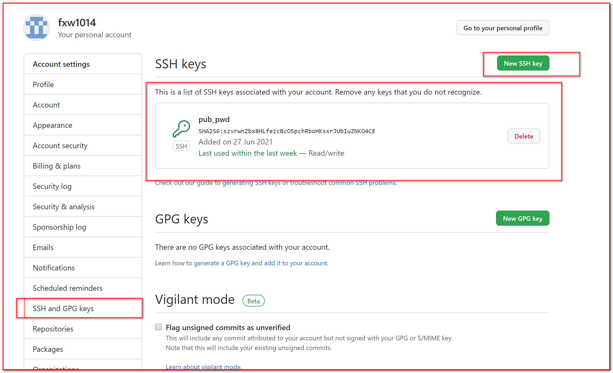
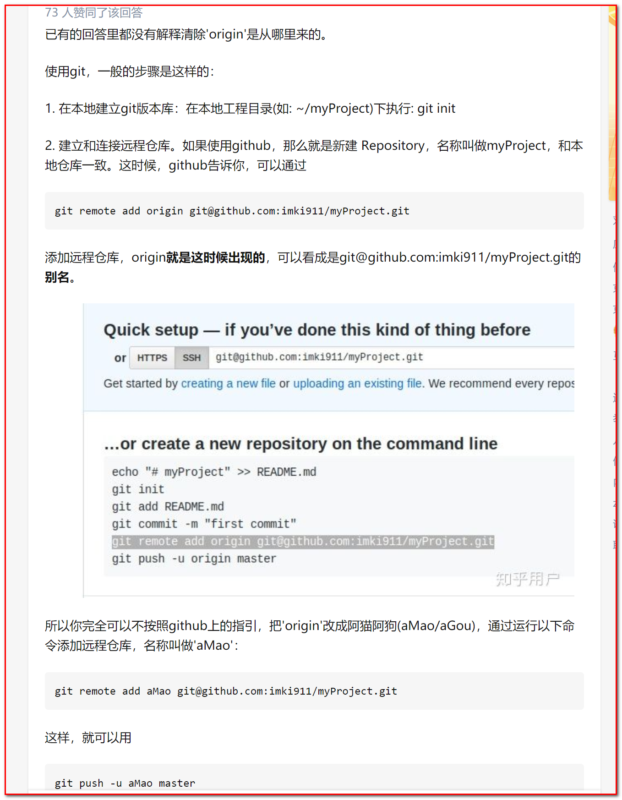

## 1. 使用场景

家中有一台电脑，公司有一台电脑，我想通过`github`来实现代码随处更新、上传（两台电脑均可更新、上传）

* 更新：将`github`上的代码更新到本地
* 上传：将`github`上的代码更新

## 2. 遇到的困难

家中电脑可以通过配置公钥、私钥与`github`实现无密码访问，但是我以为`github`只能配置一个公钥，导致公司电脑上传`github`一直报错，其实`github`上可以配置个多个公钥来匹配多个私钥

## 3. get到的东西

1. 无密码访问github

    在git等源代码管理中，使用 cat /c/Users/Tinywan/.ssh/id_rsa.pub 命令，打印并将相应内容复制到源代码管理服务器即可实现git的无密码管理。

2. 本次仓库与远程仓库建立连接

    git remote add 【远程仓库名】【远程仓库url】

3. Git 里面的 origin 到底代表啥意思?

    > * 总结来讲，顾名思义，origin就是一个名字，它是在你clone一个托管在Github上代码库时，git为你默认创建的指向这个远程代码库的标签， [@陈肖恩](http://www.zhihu.com/people/a5a1cd08e0afc7165ec1f74069541186)的答案并不准确，origin指向的是repository，master只是这个repository中默认创建的第一个branch。当你git push的时候因为origin和master都是默认创建的，所以可以这样省略，但是这个是bad practice，因为当你换一个branch再git push的时候，有时候就纠结了
    >
    > * 

    

## 【参考】

1. [如何使用git（同一账号）在多台电脑协同做工](https://www.programminghunter.com/article/5386581497/)

2. [Git与GitHub学习笔记（七）Windows 配置Github ssh key](https://www.daimajiaoliu.com/daima/3eae2a5d210040c)
3. [Git 里面的 origin 到底代表啥意思?](https://www.zhihu.com/question/27712995)

